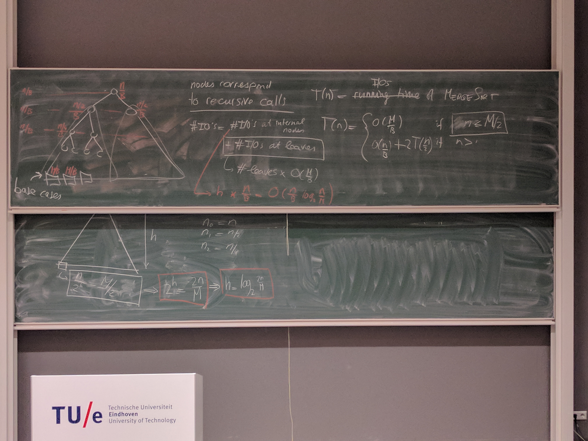

# Advanced Algorithms

[TOC]


*Course code:* 2IMA10
$$
\texttt{LaTeX commands}
\newcommand{\O}{\mathcal O}
\newcommand{\txt}{\texttt}
\newcommand{\alg}{\txt{ALG}}
\newcommand{\opt}{\txt{OPT}}
\newcommand{\lb}{\txt{LB}}
\newcommand{\eps}{\epsilon}
$$

## Lecture 1

### Course overview

The course consists of three parts:

- Approximation algorithms
  For some problems, computing exact solutions is (NP-)hard.  Approximate solution might be much easier.
- I/O-efficient algorithms
  Running time is generally analyzed in terms of number of computational steps. However, what if the main constraint is memory or disks (I/O)?
- Streaming algorithms
  This is useful for when data comes in, in large amounts, on-the-fly.

### What is an approximation algorithm?

**Load-Balancing problem:** How can we compute an optimal workload distribution over all servers?

(Some stuff that I already know so I am not writing down)

Let $\text{ALG}$ be an algorithm for a given minimization problem.
$\alg(I)$ Output of algorithm
$\opt(I)$ = Optimal output of the problem.

For minimization problems:

- $\txt {ALG}$ is a $\rho$-approximation algorithm, for some $\rho>1$, if:

$$
\txt{ALG}(I) \leq \rho \cdot \txt{OPT}(I) \qquad \forall I \in \text{Inputs}
$$


For maximization problems:

- $\txt {ALG}$ is a $\rho$-approximation algorithm, for some $\rho<1$, if:

$$
\txt{ALG}(I) \geq \rho \cdot \txt{OPT}(I) \qquad \forall I \in \text{Inputs}
$$

### Load-balancing problem

Problem statement:

- Various jobs with each having different processing time.
- Number of machines, such that the *makespan* (= maximum load on any machine) is minimized.

Input:

- Set $\{ t_1, t_2, \ldots, t_n\}$ of processing times.
- Integer $m = $ number of machines.

This is **NP-Hard** even for two machines.

Greedy algorithm: go over jobs one by one, assigning job to machine of smallest load.
$\O(n \log m)$ if we store the loads in a priority queue.

#### Proving approximation - Algorithm 1

How to prove that $\alg(I) \leq \rho \cdot \opt (I)$ when we know $\opt(I)$?

- Find lowerbound $\lb(I)$ such that $\opt(I) \geq \lb(I)$.
- Prove that $\alg(I) \leq \rho \cdot \lb(I)$.

At least one machine has:

- $Load(M_i) \geq \frac 1 m \cdot \sum_{j=1}^n t_j$, since the maximum must at least be the average.
- $$Load(M_i) \geq \max_{1 \leq j \leq n} t_j$$, since we need to assign the maximum task.

Let us define some variables:

- $M_{i^*} :=$ Machine with the largest load. Therefore: $\text{makespan}=Load(M_{i^*})$.
- $J_{j^*} := $ Last job assignment to $M_{i^*}$.
- $Load^*(M_{i^*}) = $ Load on $M_{i^*}$ just before $J_{j^*}$ was applied.

Using some mathematics and the fact that according to the algorithm the last job that is assignment will have a smaller load than the average node, as we put the task at the last machine.

As shown in the slides, we can prove that this is a 2-approximation for the job.

---

**Theorem**

Greedy-scheduling is a 2-approximation algorithm.

-----

How to improve on this?

1. Use same algorithm and same lower-bound, but better proof.
2. Use same algorithm and different louwer-bound and perhaps a better proof.
3. New algorithm / lower-bound.

If we proof more carefully, we can prove that greedy-scheduling is a $(2- \frac 1 m)$-approximation, which we can also prove is *tight*.

**The** approximation ration = $$\min_\rho \rho-$$approximiation for $\alg$= $$\max_{\text{Inputs } I} \frac{\alg(I)}{\opt(I)}$$.

#### Proving approximation - Algorithm 2

What if we first sort on the largest jobs and then the smallest job? Intuitively, we get a much better result. In fact, we can prove that it's a $(3/2)$-approximation algorithm.

This is done by the fact that a machine has at least two jobs, which both are greater than the final job assigned.

## Lecture 2 - (Weighted) Vertex Cover + LP Relaxation

*This will come in the exam!*

### Vertex-Cover problem

Given, a graph $G = (V, E)$.
Goal: Minimize $|C|$ where $C \subseteq V$ such that each edge $(u, v) \in E$ we have $u \in C \vee v \in C$.

Algorithm for vertex cover, called `VertexCoverAlg`: 

- Uncovered edges? Add an enpoint of an uncovered edge to the cover.
- Runs in $\O(|V| + |E|)$ if implemented correctly.
- Worst Case scenario: can be an $(|V|-1)$-approximation.

#### 2-approximation

Idea: pick the vertex with the highest degree.

- Results in $(\log |V| - 1)$-approximation

Why not pick both? This is called `ApproxVertexCover`.

> `ApproxVertexCover`
>
> 1. Select an edge $(u, v)$.
> 2. Add $u$ and $v$ to the vertex cover and remove all edges adjacent to both $u$ and $v$.
>
> We can, in fact, prove that this is a 2-approximation!

Lower bound: consider the **disjoint edges**, there are edges that do not share an endpoint. (*Maximal matching*). 
Let $E^*\subseteq E$ be any set of pairwise disjoint edges. $\implies$ $\opt(G) \geq |E^*|$.

Notice that all selected edges which are removed *are* pairwise disjoint!
Since we are removing all edges incident to two vertices, we are removing at least two edges. Therefore, we know that $\alg(G) \leq 2 |E^*| $.

By the way, Vertex Cover is APX-hard, meaning that it's NP-hard to approximate lower than a certain constant.

### Brief introduction to linear programming

Example:

Minimize $3x_1 - 2x_2$

Subject to:
$$
\begin{align*}
2x_1 - x_2 &\leq 4 \\
x_1 + x_2 & \geq 3 \\
-0.5 x_1 + x_2 & \geq 3 \\
x_2 & \geq 0
\end{align*}
$$
Notice that the cost function and the constraint function must be linear.

We can actually rewrite it as matrices! 

Minimize $\bf\vec c ^T \cdot \vec x$
Subject to $A \cdot {\bf \vec x} \leq {\bf \vec b}$

----

**Theorem:** LP problems can be solved in polynomial time.

(Unless it's a 0/1-LP problem)

---


Suppose $P := NP$.

Then we can derive from this that $P == NP$.
Therefore, I have proven that $P = NP$.

### Weighted vertex cover

#### Solving via 0/1-LP

**Input:** Graph $G=(V,E)$, $weight() \mapsto V \rightarrow \mathbb R$
Each vertex now has a *cost*. 
**Goal:** Select minimum-weight $C \subseteq V$ such that for each edge $(u,v) \in E$ we have $u \in C \vee v \in C$.

Can we use our previous `ApproxVertexCover` algorithm? No.
Can we model this as an LP? Yes.

> `WeightedVC-LP`
>
> Introduce a decision variable $x_v$ where:
>
> - $x_v = 1 \Leftrightarrow$ we put $v$ into the cover 
> - $x_v = 0 \Leftrightarrow$ we do not put $v$ into the cover
>
> Computing an optimal result for LP $\equiv$ Best Vertex Cover
>
> Minimize: Total weight of vertices in $C$.
> Subject to: Vertices in $C$ form a cover.
>
> Total weight of vertices in $C = \sum_{v \in  V} weight(v) \cdot x_v$
> Vertices in $C$ form a cover: $\forall_{(u, v) \in E} :x_u + x_v \geq 1$
>
> However, we also need to add a 0/1-constraint for the variables! Therefore: $\forall v \in V: x_v \in \{0,1\}$.
>
> The cover can then be found by selecting all vertices where $x_v = 1$: $C \leftarrow \{ v \in V : x_v = 1 \}$

However, this is not normal linear programming due to the constraint, but instead is 0/1 Linear Programming. This is a problem, though...

---

**Theorem:** 0/1 Linear Programming is NP-hard.

---

#### LP Relaxation

*Problem:*  $x_v \in \{0, 1\}$ is not a linear solution.**
*Solution:* What if you instead use $0 \leq x_v \leq 1$?

But then, which vertices do we put into the cover? Just pick a threshold $T$. :D

Then: $C = \{v \in V: x_v \geq T\}$.

> **Lemma:** If we pick $T = 0.5$ then $C$ will be a valid cover.
>
> **Proof:** Since we have that $x_u + x_v \geq 1$, we have that either $x_u \geq 0.5$ or $x_v \geq 0.5$.
> If $T = 0.5$, then we put at least one vertex into $C$ for every edge.

#### Analysis of the Approximation Ratio

We need a lowerbound, but this is always the same for the LP relaxation. 

The optimal solution for the relaxed LP is at least as good as the optimal solution for the 0/1-LP, because we have more options at the relaxed LP as the constraints are less rigid.
$$
\opt_\text{relaxed} \leq \opt_\text{0/1}
$$
Notice that $\opt_\text{0/1} = \opt_\text{VC}$, therefore we have: $\opt_\text{VC}  \geq\opt_\text{relaxed}$  

> **Lemma:** `WeightedVC-LP-Relaxation` is a 2-approximtion.
>
> **Proof:**
> $$
> \begin{align*}
> \texttt{WeightedVC-LG-Relaxation}(G)
> &= \sum_{v \in C} weight(v) \\
> & \leq \sum_{v \in C} weight(v) \cdot 2 x_v & \text{[Since $C = \{v \in V: x_v \geq 0.5\}$]} \\
> &= 2 \cdot \sum_{v \in C} weight(v) \cdot x_v  \\
> &\leq 2 \sum_{v \in V} weight(v) \cdot x_v \\
> &= 2 \cdot \opt_\text{relaxed} \\
> &\leq 2 \cdot \opt_\text{VC}
> \end{align*}
> $$
>

### Guide for solving Problems using LP-relaxation

1. Formulate the problem as a 0/1-LP
   - Suitable decision variables
   - Define cost function + constraints.
2. Relax the 0/1 -LP
3. ...
4. ...
5. Profit!


## Intermezzo - exercise tips

What to do with hyperedges? Add a constraint, say for 3, of:
$$
x_u + x_v + x_w \geq 1
$$
Then the constant / threshold should be $1/3$.

What if I want at least 2 of the 3 in the cover?
$$
x_u + x_v + x_w \geq 2
$$
But now the rounding is a little more tricky. 

- What about $2/3$? Well, what about $x_u = 1/2$, $x_v = 1/2$ and $x_w=1$ situation? Then we only add 1 in cover. So what about $1/2$? Well, the aforementioned is the worst-case situation, thus this should work. 

We now know that at least one of the variables

## Lecture 3 - Polynomial-time approximation schemes

### Polynomial-Time approximation schemes (PTAS) definition

Is it possible to get a $\rho$ that's really close to 1?

Algorithm $\alg$ with input:

- Problem instance $I$
- Parameter $\epsilon > 0$

$\alg$ is a polynomial-time approximation scheme (PTAS) if:

- $\alg(I, \epsilon) \leq (1 + \epsilon) \cdot \opt(I)$ (for all inputs $I$, $\epsilon$.
- Running time is polynomial in size of input instance $I$, but also depends on parameter $\epsilon$.
- Example: $\O(n^{2/\epsilon})$ or $\O((1/\epsilon)^4n^2)$. Preferably we want the latter; polynomial in $1 / \epsilon$. (Fully PTAS, aka FPTAS.)
- Maximization? $\alg(I, \epsilon) \leq (1 - \epsilon) \cdot \opt(I)$.

### Knapsack

Yeah, I know what the problem is by now. :3

Problem: Get subset $S \subseteq X$ such that $value(S)$ is maximal while $weight(S) \leq W$.

Global strategy:

1. Replace the value of each item $x_i$ by a new value $value^*(x_i)$, which is a "small" integer.
2. Solve the problem optimally for the new values.
   - **Optional:** Solved by DP. Generally given as an algorithm.
3. Return the subset computed in Step 2 as a solution for the original problem.

#### Optional: Solving step 2 by DP

We can compute an optimal solution in $\O(nV_\texttt{tot})$ time.

Alternative formulation: compute largest $j \in \{1, \ldots, V_\texttt{tot}\}$ such that there exists a subset $S \subseteq X$ with $value(S) = j$ and $weight(S) \leq W$.

**Subproblems:**

For each $0 \leq i \leq n$ and each $0 \leq j \leq V_\texttt{tot}$, compute the minimum weight of any subset $S \subseteq S_i$ with $value(S) = j$.

- Suppose we know this, can we compute the next step?

> **Dynamic Programming tip**: do we have overlapping subproblems and can we define a recursion that makes use of these overlapping subproblems?

#### Solving step 1

Idea 1: if I want integers, let's just round to the nearest value. 

- $value^*(x_i) := \lceil value(x_i) \rceil$
- Does not work, because resulting values can be very large and no control over approximation ratio $\rho$.

Idea 2: round each value to  next multiple of $\Delta$. 

- We can then round each value by $\Delta$ to get small images.


- $value^*(x_i) := \left\lceil \frac{value(x_i)}\Delta\right\rceil$

For a PTAS, notice that: $\alg \geq (1- \epsilon) \cdot \opt = \opt - \epsilon \cdot \opt$, therefore $\epsilon \cdot \opt$ is the total error we can make, thus $\text{Total error} \leq \epsilon \cdot \opt$.

Note: error on each item value is at most $\Delta$.

We have that:
$$
\left.
\begin{aligned}
\text{Error in each item}\leq \Delta \\
\text{At most $n$ items in any subset}
\end{aligned}
\right\rbrace
\text{Total error} \leq n \Delta
$$
Thus, suppose we pick $\Delta = \frac \epsilon n \cdot \opt$, then we have that $\text{Total error} \leq n \cdot  \frac \epsilon n \cdot \opt = \epsilon \cdot \opt$, which is what we wanted!

However, we don't know $\opt$, so lets find a lower bound $\lb\ \leq \opt$.

- We know that $\opt \geq $ max item weight value. Thus let's select $\lb = \max(value(x_i))$. (Assuming that we throw away all $x_i$ with weights $> W$. 

Therefore: $\Delta = \frac \epsilon n \cdot \lb$.

##### Proof

To prove that an algorithm is a PTAS, we need to show that:

1. The running time is $\geq (1-\epsilon) \cdot \opt$.
2. Running time is polynomial in $n$.
3. Output is *valid*.

Let us define $S$ as our computed solution and $S_\opt$ the optimal subset. Thus, we want to show that: $value(S) \geq (1-\epsilon) \cdot value(S_\opt) $.

- Notice that $value^*(S) \geq value^*(S_\opt)$, because $S$ is an optimal solution for $value^*$. [1]
- Furthermore, note that: $\frac{value(x_i)}\Delta \leq value^*(x_i) \leq \frac{value(x_i)}\Delta  + 1$, since by definition $value(x_i) = \left\lceil \frac{value(x_i)} \Delta \right\rceil$. [2]

Derivation:
$$
\begin{align*}
value(S)
&= \sum_{x_i \in S} value(x_i) \\
& \geq \sum_{x_i \in S} \Delta \cdot (value^*(x_i) -1) & \text{By [2]}\\
& = \Delta\cdot \left(\sum_{x_i \in S} value^*(x_i)\right) - |S| \cdot \Delta\\
& \geq \Delta\cdot \left(\sum_{x_i \in S_\opt} value^*(x_i)\right) - n \cdot \Delta & \text{By [1] and $|S| \leq n$}\\
& \geq  \sum_{x_i \in S_\opt} value(x_i) - n \cdot \Delta &\text{By [2]}\\
&= value(S_\opt) - n \cdot \Delta \\
&=  value(S_\opt) - \epsilon \cdot \lb & \text{By definition of $\Delta$} \\
& \geq value(S_\opt) - \epsilon \cdot \opt & \text{Since $\lb \leq \opt$}
\end{align*}
$$
Idea behind derivation:

1. You first start to look from $value(S)$ to $value^*(S)$. 
2. Then change $S \rightarrow S_\opt$.
3. Then we change $value^*(S_\opt)$ to $value(S_\opt)$ again.

##### Running time

For the second step, how large can $V_{tot}$ be?

- After some math: $\O(\frac{n^2}\eps)$.

We execute this a total at most $n$ times, resulting in a running time of $\O(\frac{n^3}\eps)$. 

## Lecture 4 - Exercises

**Exercise 3.4:** Show that for any $n>1$ there is a graph $G$ with $n$ vertices such that the integrality gap of the LP for Vertex Cover is $2 - 2/n$.
**Solution:** Consider $K_n$. 
Then the ideal solution for the 0/1 LP is $n-1$, because if we exclude two vertices from the vertex cover then there $\exists$ an edge which is not covered. $\opt_{0/1} = n-1$.
However, putting every vertex on $1/2$ is also a valid solution. This results in $\opt_\texttt{relaxed} \leq \frac n 2$. Then:
$$
I.G. \geq \frac{n-1}{\frac n 2} = 2 - \frac 2 n
$$


**Exercise 4.5:** Euclidean TSP
**Input:** $n$ points in the plane: $(x_1, y_1), (x_2, y_2), \ldots, (x_n, y_n)$.
**Output:** Shortest path over all vertices such that we end up on the same vertex.

Approach: 

1. Round coordinates to next multiple of $\Delta$, for a suitable $\Delta$.
2. We divide all coordinates by $\Delta$.
3. Run `IntegerTSP` on new coordinates.

What is a suitable $\Delta$?

- Note that: Total Error $\leq \eps \cdot \opt$.
- What is the maxium change in length per edge? This is the *error per edge* and this is $\leq \sqrt 2 \cdot \Delta$.
- Number of edges in a TSP is $n$, therefore: Total Error $\geq n\sqrt 2 \cdot \Delta$. 

Thus, we know that $n \sqrt 2 \cdot \Delta \leq \epsilon \cdot \opt$, thus, $\Delta \leq \frac \eps {n \sqrt 2} \cdot \opt$.
Now we need to obtain a $\lb$ such that $\opt \leq \lb$.

Now there are two different kind of lengths:

- $length(p_i, p_j)$, which is the length of edge $(p_i, p_j)$
- $length^*(p_i, p_j)$, which is the length of edge $(p^*_i, p_j^*)$.

Note that $length(p_ip_j) - \sqrt 2\cdot \Delta \leq \Delta \cdot length^*(p_ip_j ) \leq length(p_ip_j) + \sqrt 2 \cdot \Delta$.

Now, our goal is to find a derivation such that:

$length(T^*)\leq \cdots \leq length(T_\opt) + \eps \cdot \lb \leq (1+\eps) \cdot \opt$.

We do so as follows:
$$
\begin{align*}
length(T^*)
&= \sum_{(p_i, p_j) \in T^*} length(p_ip_j) \\
&\leq \sum_{(p_i, p_j) \in T^*} \Delta length^*(p_ip_j) + \sqrt 2 \cdot \Delta \\
&= \Delta \left(\sum_{(p_i, p_j) \in T^*} length^*(p_ip_j)\right) + n\sqrt 2 \cdot \Delta \\
&\leq \Delta \left(\sum_{(p_i, p_j) \in T_\opt} length^*(p_ip_j)\right) + n\sqrt 2 \cdot \Delta \\
& \leq \sum_{(p_i, p_j) \in T_\opt} \left(length(p_ip_j) + \sqrt 2 \cdot \Delta\right) + n \sqrt 2 \Delta \\
& = \sum_{(p_i, p_j) \in T_\opt} \left(length(p_ip_j)\right) + 2 n \sqrt 2 \Delta \\
& \leq length(T_\opt) + 2 \eps \cdot LB
\end{align*}
$$
Hmm, not exactly what we hoped for. What if we take $\Delta \gets 2 \Delta$? Then we get 

## Lecture 5 - I/O-Efficient Algorithm

### Why?

Sometimes, the problem does not lie in the complexity of the algorithm, but the bottleneck lies in the input and the output of the data. This can be even the case for very simple algorithms.

#### Example

**Input:** Given an elevation input map, i.e. with $A[i,j]$.
**Goal:** Compute the average elevation.

One algorithm is to go per row and sum up everything, after which we divide everything by $m^2$.
Another algorithm is to do the same, but then per column. 
Doesn't make a difference, right? $\longrightarrow$ Yea, it does.

The size of the data set is 160GB, so it does not fit into RAM!

- We need to take the I/O operations[^1] into account for the running time

In case of hard drives, it takes roughly 10-20 ms to perform an I/O operation, which can take $10^6 \times$ CPU computation time.

- Hard drive reads in blocks of ~4 KB, since the time for it to read a single item is roughly the same as reading the whole block.

### The I/O model

We have a CPU that is connected to the internal memory.

- The internal memory is connected to the external memory with *unlimited size*.
  - But the data transfer happens in blocks between these two memories.
- $M = $ size of internal memory
  $B = $ size of one block
- Tall-cache assumption: $M \geq B^2$

### Analyzing Algorithms in the I/O model

Analyze the number of I/Os as a function of $n,M,B$.

#### Example of computing the average in 2D Array

Suppose we have $B=3$, $M=15$, $m=8$, $n = m^2$, and the disk stores in row-order. The first 15 values will go fine, as they fit into the memory. 

- At the 16th, however, we need to throw out a block and then read my new block.
  - Which block to throw out? This depends on the replacement scheme used, a popular one is Least Recently Used (LRU).

Algorithm `Avg-Row-By-Row` reads and writes each block (at most) once. Number of blocks $= \lceil n / B \rceil$. Therefore, the number of I/Os = $\O(n/B)$.

Algorithm `Avg-Column-By-Column` reads a block in every step if $mB > M$ and LRU is used. Here, the number of I/Os = $n = \O(n)$.

#### I/O algorithms in real life

The number of I/Os does not depend only on the algorithm, but also on:

- The *blocking strategy*
- The *replacement policy*

In theory, the blocking strategy and replacement policy can be controlled by an algorithm, but in practice this is done by the operating system itself.

- *Cache-aware algorithms* can change this, but they need to know the memory size $M$ and block size $B$.
- *Cache-oblivious algorithms* cannot control the blocking strategy and replacement strategy and don't know $M$ and $B$, but $M$ and $B$ are used for analysis.
  - Assumptions about the OS:
    - Blocks are formed according to order in which data is written to exernal memory.
    - An optimal replacement strategy is used.


### Transposing matrices

How do we efficiently transpose a matrix? In other words, we want to swamp $A[i,j]$ with $A[j,i]$.

- We assume row-major order and that $mB > M$.

#### Simple algorithm

```python
Simple-Transpose(A)
for range(1,m):
  for range(0,i):
    swap A[i,j] and A[j,i]
```

The first loop takes $\O(n/B)$ times, but the second loop scans vertically and takes $\O(n)$ times, resulting in a total of $\O(n)$ I/O operations. :(

#### Better algorithm

Let's partition matrix into tiles $T_{i,j}$.

- Tiles have a size of at most $t \times t$, where $t$ is chosen such that a *pair of tiles* fits into internal memory.
  $$
  \#\ tiles = \lceil m/t \rceil \times \lceil m/t \rceil = \O(n/t^2)
  $$

- Idea: read pairs of tiles, swap their elements, write tiles back, and so on.

- How should we pick $t$? 

  - Idea 1: $2t^2 \leq M$. Does not quite work as there can be blocks sticking out of the tile.
  - Idea 2: Per row, there can be $2\cdot (B-1)$ blocks sticking out.

**Theorem:** `Cache-Aware-Transpose` performs in $\O(n/B)$ I/Os

#### A Cache-Oblivious Algorithm

The way we can do a Cache-Oblivious algorithm, is by using the same idea but with recursion. 

- We keep on recursing until we can fit the blocks into memory. This time, we can even recurse back to $2$ or $1$ and make this is our base case.

**Theorem:** `Cache-Oblivious-Transpose` performs in $\O(n/B)$ I/Os.
$$
T(m) = 
\begin{cases}
\ldots & \text{if subproblem fits into memory} \\
\ldots & \text{otherwise}
\end{cases}
$$
Remember, two $m \times m$ submatrices need to fit into the internal memories, therefore:
$$
2m^2 + 4m(B-1) \leq M
$$

#### Footnotes

[^1]: Think about the read and write speeds of a *hard disk* or a *solid state drive*.

## Lecture 6 - I/O Efficient Algorithms: Fundamental Results

Great properties for I/O efficient algorithms:

- **Spatial Locality:** Subsequent memory accesses $\rightarrow$ Clustered on disk (so we can retrieve them in few blocks).
- **Temporal Locality:** Times at which data element is needed $\rightarrow$ Clustered in time.

### Replacement policies

#### Different policies

**Least Recently Used (LRU)**

- Time stamp = time @ block-usage
- Throw out block with oldest time stamp.

**First-In First-Out (FIFO)**

- Time stamp = time @ block-fetch
- Throw out block with oldest time stamp

**Longest Forward Distance (MIN)**

- Throw out block that is not needed for the longest time.
- (**Always optimal**, but *impossible* to implement.)
- Is assumed to be used when we use *Cache-Oblivious* algorithms.

#### LRU vs MIN

Sometimes, $LRU \gg MIN$ in terms of performance, $\O(M/B)$ vs $\O(1)$.

- Generally, LRU approximates MIN quite well, though: LRU with internal memory size $M$ performs $2 \times I/Os$ vs MIN with internal memory $M/2$.

More formally: consider algorithm `Alg` with replacement policies LRU and MIN.

- `LRU(Alg, M)` = I/Os done by LRU with memory size $M$.
- `MIN(Alg, M)` = I/Os done by MIN with memory size $M$.

---

**Theorem**

For any `Alg` and any $M$, $M'$ with $M \geq M'$, we have that:
$$
\texttt{LRU(Alg, M)} \leq \frac M {M-M'  +B} \cdot \texttt{MIN(Alg, M)}
$$

---

Note: $M' = M/2$ results in $\texttt{LRU(Alg,M)} \leq 2 \cdot \texttt{MIN(Alg,M)}$. 

### I/O-Efficient Sorting

#### Normal MergeSort

Consider `MergeSort(A)`. This runs on $\O(n \log n)$. But how many I/Os?
Let $T(n) = $ # of I/Os with array of size $n$.
$$
T(n) = 
\begin{cases}
? & \text{if subproblem fits into memory}\\
? & \text{otherwise}
\end{cases}
$$
When does the subproblem fit into memory? Well, consider the basic mergesort. We have $n$ blocks in memory, but we also use two times $n/2$ for the recursive call. Therefore:
$$
n + 2 \cdot \frac n 2
$$
 However, this is not completely true, as blocks can stick out. Therefore:
$$
n + 2(B-1) + 2\cdot (\frac n 2 + 2(B-1)) \leq M
$$
To make it easier, however, we'll just consider $2n \leq M$ for now:
$$
T(n) = 
\begin{cases}
\O(\frac M B) & 2n\leq M\\
? & \text{otherwise}
\end{cases}
$$

- Why $M/B$? In the base case we assume that all of the arrays fit into the memory. Therefore, we just load everything into memory and write it back again, which takes at most $\O(M/B)$ time.

Then, how many does the other step take?

- Consider the first part, partitioning $A$ into subarrays $A_1$ and $A_2$, and merging.
  - Partitioning takes at most 3 scans, once over $A$, once over $A_1$ and once over $A_2$. This takes at most $\O(n/B)$ time.
  - Similarly for the merging, we just have two points over $A_1$ and $A_2$ together in $A$, which takes at most $O(n/B)$ time as well.
- Finally, we have a recurrence, which is similar to `MergeSort`.

$$
T(n) = 
\begin{cases}
\O(\frac M B) & 2n\leq M\\
2\cdot T(\frac n 2) + \O(n/B) & \text{otherwise}
\end{cases}
$$

This results in $\O(\frac n B \log_2 \frac n M)$. It can be improved, though, especially the $\log_2$. :D

- Intuitively, we can go for $B$ steps instead of $2$ steps with divide & conquer and binarySearch.

But first we're gonna solve the recurrence. See the image below for the result.



#### Better MergeSort

The height of the branching tree was in the form of $h=\O(\log_2 \frac {n} M)$. Can we improve this?

- Suppose we partition into $k$ subarrays $A_1, \ldots, A_k$, where we want to pick $k$ as large as possible.  
- What goes wrong if $k$ is too large? The overhead term $\O(\frac n B)$ will then might be higher. In particular, merging $k$ arrays back into 1 array. In particular, we need a block for each of the $k$ arrays + 1 for filling in the new array. 
- Thus, we can pick $k = M/B-1$. *Not Cache-Oblivious.*

$$
T(n) = 
\begin{cases}
\O(\frac M B) & 2n\leq M\\
k\cdot T(\frac n k) + \O(n/B) & \text{otherwise}
\end{cases}
$$

This runs in $\O(\frac n B \log_{M/B} \frac n M)$ I/Os. We'll call this `Sort(n)` which is easier. This is a strict bound, so we cannot do better.

## Lecture 7 - Buffer Trees & Time-forward processing

### Buffer Trees

#### B-trees

$S = $ set of $n$ elements
$key(x_i) =$ identifier of element $x_i \in S$.

What are options for this?

- Hash table ($\O(1)$ expected time)
- Balanced Binary Search Tree (e.g. red-black ree).
  - All operations $\O(\log n)$ time.
  - Also supports `successor`, `max`, and `min`.
  - Idea: depth is $\O(\log n)$

How many I/Os do we perform when we walk down the tree?
Depending on the blocking strategy: $\O(\log_2 n)$.

Idea for I/O efficiency:

- Reduce the depth of the tree! 

  - Put many elements into each node.

    $\implies$ high branching degree

    $\implies$ tree less deep

A branching degree of $k$ results in a depth of $\O(\log_k \frac n k)$.

We want to chose $k$ as large as possible, but a node should still be within a block.

- There are called $B$-trees.
- The # of elements stored in *any* node is between $d_\texttt{min}-1$ and $2d_\texttt{min} -1$. With this we can ensure that all elements are at the same level.
- $d_\texttt{min} = \Theta(B)$
- $\O(\log _B \frac n B)$ I/O operations

Still, $B$-trees are not perfect, since $n$ insertions will take $\O(n \log_B \frac n B)$ I/Os.
We would like $\texttt{Sort}(n)$.

#### New idea... Buffer operations!

If we buffer operations such that we can do various searches at once, then we can perform faster than the previous bound.

Similar to $B$-tree:

- Search tree with all leaves at the same level.
- Leaf nodes store $\Theta(B)$ elements.
- Internal nodes store between $d_\texttt{min}-1$ and $4d_\texttt{min} -1$, where $d_\texttt{min} = \Theta(M/B)$.

Internal memory contains a single block $b^*$ storing unprocessed operations.
Every internal node $v$ has a buffer $B_v$ of size $M/B$, storing operations that have not yet been fully processed.

Idea: add operations to $b^*$ until $b^*$ is full, thne prrocess $b^*$ as follows:

- If $B_\texttt{root}$ still has space, then put $b^*$ into $B_\texttt{root}$.

- If $B_\texttt{root}$ overflows, then flush the buffer $B_v$.

  - This basically means that we push everything one level down the tree.

  1. Read $B_v$ into internal memory.
  2. Sort operations from 4B_v$ on their key.
  3. Write operations to the buffers on the appropriate children.
     - If the buffer of a child overflows? Flush it.

##### I/O Analysis

$d_\texttt{min} = \Theta(M/B)$ and leave stores $\Theta(B)$ bound.

- Depth of a buffer tree is $\O(\log_{M/B} \frac n B) =  \O(\log_{M/B} \frac n M)$.

Each operation is pushed down in $\O(\log_{M/B} \frac n M)$ times.

- There are $\O(\log _{M/B} \frac n M)$.

Cost of flush: read $\Theta(M)$ elements $\rightarrow$ sort $\rightarrow$ write to children.

- $\O(M/B)$ I/Os for their eading and the writing. Sorting happens in internal memory.
- Realize that we now have a rough time of $\O(1/B)$ per element. :D

This results in the sorting bound.

### Priority Queue

Ideas: we assign a priority to each key

- ​

**Heap**

- All operations in $\O(\log n)$ time.

**Balanced binary search tree**

- Use the $prio(x_i)$ as key.
- The leftmost leaf will be the lowest priority.
- All operations in $\O(\log n)$ time.

In each phase, do:

- `ExtractMin`
  - Flush all nodes on the leftmost search path.
  - Let $S^*=M/4$ smallest elements. Load $S^*$ into internal memory and delete the elemeents from the buffer tree.
- Perform next $M/4$ operations on $S^*$, which is in internal memory.
  - `ExtractMin` can be answered directly.
  - `Insert` is stored.
- End of phase: all elements have been inserted into $S^*$ $\implies$ insterted into the buffer tree.

----

**Theorem**

There is an I/O-efficiednt priority queue that can process any sequence of $n$ `Insert` and `ExtractMin`-operations in $\O(Sort(n))$ I/Os in total.

### Time-Forward Processing

Consider *local functions* on a DAG.

Consider labelled DAG $G=(V,E)$.

- $\lambda(v_i) =$ label of node $v_i$.
- $f:V \mapsto \dots$ is a local function where $f(v_i)$ only depends on.
  - Label $\lambda(v_k)$
  - The $f$-values of the in-neighbors of $v_i$.

**Example:** Expression tree for mathematical operations. 

We assume that vertices are numbered in *topological order*. 
Furthermore, the DAG is stored in an adjacency list representation.

**Blocking strategy:** blocks are formed by first going over $A[1]$ and its list of out-neighbours, then $A[2]$ and so forth.

**Better approach:** Use priority $Q$ instead of array $L$ of lists.

When $f(v_i)$ has been computed, do the following:

- For each out-neighbour $v_j$ of $v_i$, make a copy of $f(v_i)$ and insert that copy into $Q$ with priority $j$.

When we later want to compute $f(v_i)$ $\implies$ Extract $f$-values from $Q$ which have priority $j$.

---

**Theorem**

A local function on a DAG sorted in topological order in external memory can be evaluated in $\O(Sort(|V| + |E|))$ I/O operations...

... provided we can compute $f(v_i)$ from $\lambda(v_i)$ and the $f$-values of $v_i$'s in-neighbours using $\O(Sort(\text{# of in-neighbours}))$ I/Os.

---

Can we actually use the previous theorem for undirected graphs?

Yes, we can!

> Example - Computing a maximal independent set on an undirected graph.
>
> 1. Pretend that $G$ is directed with edges directed: low indices $\rightarrow$ high indices. 
>
>    - We just ignore all entries in the adjecencies that go in the wrong direction.
>
> 2. Define function $f$ that indicates whether a vertex is selected.
>    $f(v_i) = 1$ means we put $v_i$ in the independent set.
>    $f(v_i) = 0$ means we don't.
>    $$
>    f(v_i) = 
>    \begin{cases}
>    1 & \text{when $v_i$ has no in-neighbours} \\
>    0 & \text{when $v_i$ has an in-neighbour with $f(v_i) = 1$}\\
>    1 & \text{when all in-neighbours of $v_i$ have $f(v_i) = 0$}
>    \end{cases}
>    $$
>
> 3. ​

## Lecture 8 - Permutation Lower bound + exercises

### Permutation Lower bound

**The permutation problem:** Let Array $A[0 \ldots n-1]$ with $A[i] = (pos_i, x_i)$.

- $pos_0, \ldots, pos_{n-1}$ is a permutation of $0, \ldots, n-1$.

**Output:** Re-arrangement of the elements in $A$ such that $A[i]$ contains $(pos_i, x_i)$.

---

**Theorem**

Any algorithm for the permutation problem performs $\Omega(\frac n B \log_{M/B} \frac n B)$ I/Os in the worst case, assuming $n < B \sqrt {\binom n b}$. 

If $n$ is bigger, than the lower bound becomes $n$.

----

**Assumptions** (for simplification)

- $\alg$ can only move elements around between internal and external memory; it does **not copy** elements.
- $\alg$ only reads and writes full blocks.

Therefore, the *basic operations* performed by $\alg$ are:

- **read:** Move a block from external to internal memory.
- **write:** Select $B$ elements from internal memory and write them as one block back to a specific place in external memory.

Initial state: everything is in external memory.

Blah blah blah proof.

## Lecture 9 - Streaming Algorithms I

### Introduction to streaming algorithms

**Setting:** We have *very little* storage to save stuff.

These algorithms are needed for even trivial questions. 

**Stream** = sequence $\sigma = \langle a_0, \ldots, a_{m-1} \rangle$ of tokens.

- These tokens are usually integers from universe $[n] = \{0, \ldots, n-1\}$
- Usually $n$ is known, but the size of the stream $m$ is unknown.

**Goal:** Compute a *single* statistic $\Phi(\sigma)$.

- $\Phi(\sigma)$ only depends on **frequency vector** $F_\sigma[0..n-1]$
  - $F_\sigma[j]=$ # of occurences of $j$ in $\sigma$.

**Different streaming models**

- **Vanilla model:** token = item $j$ from universe.
  Arrival of $j$ means $F_\sigma[j] \gets F_\sigma[j] + 1$
- **Turnstile model:** token is pair $(j,c)$ where $j$ is an item and $c$ an integer.
  Arrival of $(j,c)$ means $F_\sigma[j] \gets F_\sigma[j] + c$
  - **Strict turnstile model:** $\forall j:F_\sigma[j] \geq 0$
  - **Cash-register model:** $\forall_ {(j,c)\in \sigma}: c > 0$
- **Multi-pass model:** We are allowed to make several passes over the stream.
- **Windowing model:** maintain statistic $\Phi$ over the last $W$ items in the stream.

### Quality of streaming algorithms

**Amount of storage**, measured in bits. 
Ideally: $\O(\log n + \log m)$ bits

**Precision of the answer**
Computing $\Phi(\sigma)$ with sublinear number of bits is *usually impossible*.
Approximating $\Phi(\sigma)$ deterministically is *usually impossible*.

$\alg$ is an $(\epsilon, \delta)$**-approximation algorithm** when:
$$
\mathbb P[|\alg(\sigma) - \Phi(\sigma)| > \epsilon \cdot \Phi(\sigma)] < \delta \qquad \forall\sigma
$$
**Time duration**
Computing time to process a token.
Time to compute an answer when requested.

### Frequent-Items problem

**Input:** $\epsilon >0$ and stream $\sigma=\langle a_0, \ldots, a_{m-1}\rangle$ (*vanilla model*)
**Output** $\Phi(\sigma):$ Set $I_\epsilon(\sigma)$ containing all $\epsilon$-frequent items $j$ for which $F_\sigma[j] > \epsilon \cdot m$.

**Majority item:** item that occurs more than half the time = $(1/2)$-frequent item

---

**Theorem**

Any deterministic algorihtm for deciding if a stream has a majority item must use $\Omega(m \log (n/m))$ bits in the worst case.

---

> *Proof.*
>
> Consider the stream $\sigma = \langle a_0, a_1, \ldots, a_{m/2-1}, a_{m/2}, \ldots, a_m \rangle$. 
> Define $\sigma_1 =\langle a_{1}, \ldots, a_{m/2-1} \rangle$ and $\sigma_2 =\langle a_{m/2}, \ldots, a_m \rangle$. 
> Furthermore, let us define a different permutation of $\sigma$ such that $\sigma'_1 =\langle a'_{1}, \ldots, a'_{m/2-1} \rangle$.
>
> The first stream is $\sigma = \sigma_1 \circ \sigma_2$ and the second stream is $\sigma' = \sigma'_1 \circ \sigma_2$.
>
> Let $s$ be #bits used by $\alg$. Then after processing the first $m/2$ items, $\alg$ can be in $2^s$ different states. 
>
> Let us define $X = \{ \text{all streams of length $m/2$ with all distinct items}\}$. Then $|X| \ge \binom n {m/2}$.
> If $\binom n {m/2} > 2^s$, then there exists two different streams $\sigma_1, \sigma_1' \in X$ that end up in the same state. Furthermore, since $\sigma_1$ and $\sigma'_1$ all have distinct items and they are different, there must exist an element that is in $s_1$ and not in $s_2$, in other words: $\exists j \in [n] : j \in \sigma_1 \wedge j \not\in \sigma'_1$. 
>
> Now take $\sigma_2=\langle \underbrace{j, j, \ldots,j}_\texttt{m/2 times}\rangle​$. We have that $\sigma_1 \circ \sigma_2​$ has a majority item whereas $\sigma'_1 \circ \sigma_2​$ does not.
>
> Hence $s$ must be such that $2^s \geq \binom n {m/2}$.
> $$
> 2^s \geq\binom n{m/2} \geq \left(\frac n {m/2}\right)^{\frac m 2} \\
> s \geq\log \left(\left(\frac n {m/2}\right)^{\frac m 2}\right)= \frac m 2 \cdot \log \left( \frac{2n} m \right)
> $$
> Therefore, we need at least $\Omega(m \log n/m)$ bits in the worst case.

So, there doesn't exist any streaming algorithm with little bits that computes all frequent items. Can we use any other technique?

Well, we can compute a set $I_\epsilon$ of size at most $1/\epsilon$ that contains all $\epsilon$-frequent items (+ some other, non $\epsilon$-frequent items).

> **Algorithm** for computing $I_\epsilon$
>
> ```python
> if a_i not in I # First time encouter or already thrown out
> 	Insert a_i in I
>   	if |I| >= 1/eps
>     	for a_j in I
>       		count[j] -= 1
>       	for a_j in I
>         	I.remove(a_j) if count[j] == 0
> else
> 	count[i] += 1 # Counting the number of a_i that have already happened
> 	
> ```
>
> The idea is to count the number of consecutive happenings of $a_i$. If an item is really $\epsilon$-frequent, then it should happen that at least 
>
> We keep a counter $\tilde F_\sigma[j]$ for each element $j$.
>
> - Number of increments to 
>
> Since there are $1/\epsilon$ different counters of the algorithm, any $count[j]$ is decremented at most $m / \frac 1 \epsilon = \epsilon m$ times.

---

**Theorem**

The above algorithm reports a set $I_\epsilon$ of size at most $1/\epsilon$ containing all $\epsilon$-frequent items (and possibly other items). Furhtermore, this algorihtm uses $\O((1/\epsilon) \log(n+m))$ bits of storage.

---

##Lecture 10 - Streaming Algorithms II

### Intro to probability

Here, we are introduced to some basic concepts, such as random values and expected values. 

**Markov Inquality:** $\mathbb P[X> t \cdot \mathbb E[X]] < 1/t$ (when $X$ is non-negative).

**Chernoff Bound for Poisson trials:** for any $\delta > 0$
$$
\mathbb P[X > (1+ \delta) \mathbb E[X]] < \left(\frac{e^\delta}{(1+\delta)^{(1+\delta)}}\right)^{\mathbb E[X]}
$$
In particular: $$\mathbb P[X>3 \mathbb E[X]] < \left(\frac 1 2 \right)^{\mathbb E[X]}$$

**Chebyshev inequality:** $\mathbb P\left[|X-\mathbb E[X]| > t \cdot \sqrt{\mathbb V[X]}\right] < \frac 1 {t^2}$

### The median problem

Define $rank(a_i)$ as $1 + \#$ of items in $\sigma$ that are smaller than $\alpha_i$.

**Problem:** find the medium of stream $\sigma$.

---

**Theorem**

Any deterministic lagorithm for computing the median exactly must use $\Omega(m \log n/m)$ bits in the worst case, when $m < n/2$.

---

We'll settle for an $\epsilon$-approximate median, which is often good enough.
$$
\left\lfloor(\frac 1 2 - \epsilon) (m+1) \right\rfloor \leq rank(a_i) \leq \left\lceil (\frac 1 2 +\epsilon)(m+1)\right\rceil
$$
We assume that we have a subroutine `Random(a,b)` which reports a random value uniformly between $a$ and $b$ in $\O(1)$ time. Want a coin flip? $\rightarrow$ `Random(0,1)`

1. Algorithm 1: pick a random item from the stream

   - Just pick a random $r$ between $0$ and $m-1$ and pick this item.
   - What's the quality?
     - $\mathbb E[rank(j)] = \frac {m+1} 2$.
     - The streaming algorithm reports a $(1/4)$-approximate median with probability $1/2$.

2. Algorithm 2: use the **median trick**!

   - The larger my sample, the better we can approximate the distribution.

   - **Idea:** Collect $k$ answers $j_1, \ldots, j_k$ and report the *median*.
     In streaming setting: do simultaneously!

     The algorithm reports a $1/4$-approximate median with probability at least $1-2(e/4)^{k/4}$ and uses $\O(k \log (n+m))$ bits of storage.

   - Plan for the proof: 

     - Rank of reported items is too small $\Longleftrightarrow$ at least $k/2$ sampled items have rank $m/4$.

     - Create an indicator variable where $X_i = \mathbf 1\{rank(i) < m/4\}$

     - We know that $\mathbb P[X_i] = 1/4$
       $$
       \mathbb E[X] = \mathbb E\left[\sum_{i=1}^k X_i\right] = \sum_{i=1}^k\mathbb E[X_i] = \sum_{i=1}^k \mathbb P[X_i = 1] = \sum_{i=1}^k \frac 1 4 = \frac k 4
       $$

       $$
       \mathbb P[X > k/2]
       $$


## Lecture 11 - Probablistic hashing algorithms

###Randomized streaming algorithm for distinct-items problem

**Input:** $\sigma=\langle a_0, \ldots, a_{m-1}\rangle$ of $m$ items

**Output:** Set of distinct items in $\sigma$

Let $J$ be the set of distinct items in $\sigma$. Furthermore:

- $D = |J| = $ number of distinct items.
- $j_\text{max}$ is the largest item in $J$, i.e. in $\sigma$.

> Example:
>
> Suppose we pick $D$ items in $J$ randomly from $[n]$.
>
> - If $j_\text{max} = n$, what is your estimate of $D$?
> - If $j_{max} = n/4$, what is your estimate of $D$?
>   - Well, if $D$ is large, say 10, then for each item we get only a probability of $0.25$ that it is $< n/4$. Therefore, this probability is very small, namely $1/(4^{10})$!

In fact, we can estimate $D$ from the value of $j_\text{max}$!

Algorithm: Maintain $j_\text{max}$ and estimate $|J|$ based on value of $j_\text{max}$.

- Storage: $\O(\log n)$.

But... can be done better.


Construct a random hash function $h:[n] \rightarrow [n]$.

- $j_\text{max} \gets -1$

Process: 

```python
if h(a_i) > j_max:
    j_max := h(a_i)
```


----

**Lemma**

Let $\tilde D = 2^{i^* + 1/2}$ be the estimate returned by our algorithm.
$$
\mathbb P\left[\frac 1 {4 \sqrt 2} \cdot D \leq \tilde D \leq 4 \sqrt 2 \cdot D\right] \geq \frac 1 2
$$

-----

