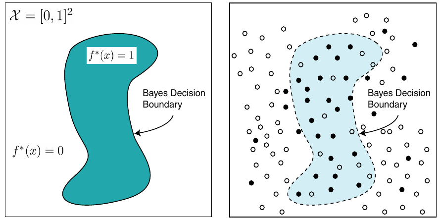

# SLT - Summary

> By Joost Visser

[TOC]

$$
\texttt{LaTeX commands}
\newcommand{\E}{\mathbb E}
\newcommand{\V}{\mathbb V}
\newcommand{\P}{\mathbb P}
\newcommand{\R}{\mathbb R}
\newcommand{\N}{\mathbb N}
\newcommand{\F}{\mathcal F}
\newcommand{\X}{\mathcal X}
\newcommand{\Y}{\mathcal Y}
\newcommand{\O}{\mathcal O}
\newcommand{\S}{\mathcal S}
\newcommand{\1}{\mathbf 1}
\newcommand{\fhat}{\hat f_n}
\DeclareMathOperator*{\argmin}{arg\,min}
$$

## Chapter 0 - Summarising the summary

### Course summary

The goal of this course is supervised learning. 

1. We have an input $X \in \X$ and an output which we want $Y \in \Y$.
2. Our goal is to find the function $f$ such that $f(X) = Y$ or at least close to $Y$.
   - More concretely, we want to minimize a certain loss function $\ell$ that depends on the setting (such as binary classification or regression).
3. The only thing we have access to is a dataset $D_n \equiv \{X_i , Y_i\}_{i=1}^n$ which we assume is i.i.d. from the actual data distribution (called $\P_{XY}$).

Using various methods in the lecture notes, we can derive upperbounds on the excess risk (expected loss) for many different models of classifiers $\F$. 

We start with simple settings and many assumptions, namely binary classification and Lipschitz functions, and build up to get bounds on $\F$ where $\F$ is uncountably infinite.

Furthermore, we will see a very good way to pick our estimator $f$ from $\F$ with the data in the dataset $D_n$. (Using *Penalized empirical risk minimization*.)

### Chapters summary

Chapter 1 lays out the setting of the whole book. All definitions such as empirical risk and data spaces are explained over there.

Chapter 2 considers two settings, binary classification and regression and explores the loss function, the Bayes classifier, risk and empirical risk minimization here. There is actually a tradeoff for the risk in approximation and estimation error, which is explored in Chapter 3.

Chapter 4 starts exploring a very limited setting where the data is created via a Lipschitz smooth function with noise. We derive bounds for the expected excess risk when we use piecewise constant functions as our classifier.

Starting from the fifth chapter onwards, we consider a much larger variety of settings where $\P_{XY}$ can be any unkown distribution. In chapters 5, 6 and 7, we will derive PAC bounds for our estimation error, as well as how well the empirical risk minimizer performs.

Chapter 8 extends this idea to countable infinite classes and introduces the idea of *complexity regularized risk model*, to pick our estimator as a combination of the empirical risk with some error term that depends on the complexity of our class. This is illustrated with the histogram classifier in Chapter 9.

Chapter 10 shows that the *minimum penalized empirical risk predictor* actually balances a tradeoff between approximation and estimation error. Furthermore, this chapter shows a new and powerful type of classifier, the (dyadic) decision tree classifier. Finally, a computation of the excess risk is performed for both the histogram classifier and the decision tree classifier.

In Chapter 11, we will consider uncountable infinite classes and derives PAC bounds and expected excess risk bounds using VC bounds. These are then applied to various classifiers and their bounds are shown.

Finally, Chapter 12 considers the regression setting of piecewise smooth functions with noise (such as an image with noise), an extension of Chapter 4, and uses the dyadic decision tree classifier to bound the excess risk via penalized empirical risk minimization.

## Chapter 1 - Some definitions

### Data spaces

Goal of statistical learning theory: *supervised learning*. 

- Construct a classifier / function that takes an input and outputs the corresponding output.

**Data spaces:** Set that is given as input, and the set on which the output should be an element from. 

- $\X$ represents the input space, $\Y$ represents the output space.

Training data: $\{(X_i, Y_i)\}^n_{i=1}$

### Loss function

**Loss function** measures how different the predicted label $\hat Y \in \Y$ compares with the actual label $Y \in \Y$. This is a function that takes $\hat Y$ and $Y$, and maps it to a real value (i.e. the loss).

- $\ell(\hat y, y) = \1\{\hat y \neq y\}$ for binary loss. 
  When we predict the wrong label, the loss is 1, else it is 0.

Note that these loss functions don't have to be symmetric, as is shown in the spam example where false positives should be punished much more than false negatives.

In *regression*, the *squarred error* loss function is often used: $\ell(\hat y, y) = (\hat y - y)^2$.

### Probability measure and Expectation

Define a join probability destribution on $\X \times \Y$ and $\P_{XY}$, where $(X,Y)$ is a pair of random variables distributed according to $\P_{XY}$. This can also be described as the marginal distribution of $X$ ($\P_X$) and the conditional distribution of $Y$ given $X$ ($\P_{Y|X}$). 

Let $p$ denote the density function of $\P$. Then we have the expectation operator:
$$
\E[f(X, Y)] \equiv \int f(x,y)d\P_{XY}(x,y) = \int f(x,y)p_{XY}dxdy
$$

### Statistical risk

The **risk** is how well the classifier does on average, also known as the expected loss. 
Given prediction rule $f$ and $\P_{XY}$, then the risk is defined as:
$$
R(f) \equiv \E[\ell(f(X),Y | f]
$$
The *minimum risk* is the best possible risk, which is where we're interested in.
$$
R^* = \inf_{f\texttt{ measurable}} R(f)
$$

### Learning

To compute the risk, we need to know the distribution $\P_{XY}$. However, this generally is unknown, so we try to learn a good prediction rule $f$ using the training data!

*Assumption:* We assume that the training data $D_n \equiv \{X_i, Y_i\}^n_{i=1}$ is i.i.d. according to $\P_{XY}$.

- *Independence:* Samples comes from different sources and do not influence each other.
- *Identical:* The samples we have are a representative sample of the type we might encounter in the future.

*Learning goal:* Use training data $D_n$ to choose a function / mapping $\hat f_n$ out of a class of candidate prediction rules $\F$. 

- Main goal of this course is to guarantee that $R(\hat f_n)$ is small with a very high probability.
- We could also consider the *expected risk*: $\E[R(\hat f_n]$.

**Law of total expectation:** $\E[\E[Y|X]] = \E[Y]$.

- Note that $\E[Y|X]$ is conditioned on $X$, which is random, thus $\E[Y|X]$ is also a random variable!

**Law of total probability:** $\P[X] = \sum_n \P[X|Y_n] \P[Y_n]$

- This can be another formulation: $\P[X\leq x] = \E[\P[X \leq x|Y]]$
- The idea is to consider all different events $Y_n$ to calculate $\P[X]$.

**Bayes' theorem:** $P(A|B) = \frac{P(B|A)P(A)}{P(B)}$

## Chapter 2 - Binary classification and Regression

### Binary classifiation

In this chapter, we will consider the **binary classification** setting and the **regression** setting. We will use the familiar 0/1 loss function:
$$
\ell(\hat y, y) = \1\{\hat y \neq y\}
$$
In this setting, the risk of classifier $f$ can be rewritten to a probability:
$$
R(f) = \P(f(X) \neq Y)
$$
Thus, the risk is simply the probability of making errors. 

The performance of the best classification rule known is the **Bayes risk**:
$$
R^* = \inf_{f\texttt{ measurable}} R(f)
$$
The best classifier is known as the Bayes classifier:
$$
f^*(x) = \1\{\eta(x) \geq \frac 1 2\}
$$

- Where $\eta(x) = \P_{Y|X}(Y=1|X=x)$ is the feature conditional probability.

This basically tells that if you know for given $X=x$ that the probability of $Y=1$ is greater than the probability of $Y=0$, then we should classify 1. 
This has the best risk we could hope for:
$$
R(f^*) = R^*
$$
In practice, however, we don't know the distribution $\P_{XY}$, so we cannot construct $\eta(x)$.

**Excess risk:**  risk we get over the best possible risk. Can be calculated as follows:
$$
R(g) - R^* = \int_{G \Delta G^*}|2\eta(x) - 1|d\P_X(x)
$$

- Where $G \Delta G^* = (G \cap \bar G^*)\cup(\bar G \cap G^*)$ is the symmetric set difference, the xor.

Example: *Linear classifiers*. These are classifiers where a line (/ hyperplane) is drawn on the feature space $\X$ and one part is classified as 1, while the other part is classified as 0.
$$
\F = \left\{x \mapsto f(x) = \text{sign}(w^Tx)\right\}
$$
Fun facts: 

1. If there exists a hyperplane that separates the classes pefectly, then it can be found efficiently using e.g. the perceptron algorithm.
2. If there does not exist such hyperplane, finding the hyperplane that minimizes the risk is computationally very demanding.

### Regression

In regression, the prediction rule is often called an *estimator*. For this setting, consider the squared loss function:
$$
\ell(\hat y, y) = (\hat y - y)^2
$$
In this setting, we can rewrite the risk as follows:
$$
R(f) = \E\left[(f(X) - Y^2)\middle| f\right]
$$
The regression function has the lowest possible risk, which can be written as:
$$
f^*(x) = \E[Y | X=x]
$$
And this risk equals the Bayes risk:
$$
R(f^*) = R^*
$$
Example: *(Linear) regression*. Let the possible estimators be:
$$
\F = \{\text{degree $d$ polynomials on }[-1, 1]\}
$$
Then, the empirical risk minimizer (see below) is the classifier which minimizes the MSE. The best classifier can be found using some fancy linear algebra ((Chebyshev) Vandermonde matrix).

### Empirical Risk Minimization

How do we actually use the data to choose a good prediction rule $f$? One way of doing so is to calculate the risk on the training data, $\hat R_n$, and pick the $f$ that reduces this risk as much as possible. 

**Empirical risk:** The risk of the training data.
$$
\hat R_n(f) = \frac 1 n \sum_{i=1}^n \ell(f(X_i), Y_i)
$$
So, the idea of picking the $f$ that minimizes this empirical risk the most is called *empirical risk minimization*.

**Empirical risk minimizer:** Choose the rule that minimizes the empirical risk.
$$
\hat f_n = \argmin_{f \in \F} \hat R_n(f)
$$
By the law of large numbers, we know that $\hat R_n(f)$ will eventually converge to $R(f)$ if $n$ is large enough. 

### Model Complexity and Overfitting

Suppose our $\F$ is really large. Then we can make our empirical risk really small, as we have many different functions to choose from. In the most extreme case, we can even consider $f_{bad}$ that predicts $Y_i$ for all $x=X_i$, and 0 otherwise. However:

- This rule predicts zero for any value of the feature not in the dataset.
  - $\hat R_n(f_{bad})$ will be 0, but $R(f_{bad})$ will be very large.
- This rule fits the data "too well" (overfits) and doesn't learn anything outside teh dataset.

Thus, if we make $\F$ too large, we might fit the training data too well. So we do not want a class of models that is too large when considering empirical risk minimization.

## Chapter 3 - Competing Goals: approximation vs estimation

### Approximation and Estimation error

As shown in the previous chapter, the size of $\F$ seems to play a crucial role on the performance of the estimator. One way of avoiding overfitting is to restrict $\F$ to some measure set. To analyze the performance of a $\hat f_n$ with this in mind, consider the following representation of the *expected excess risk*:
$$
\E[R(\hat f_n)] - R^* = 
\underbrace{\left(\E[R(\fhat)] - \inf_{f \in \F} R(f) \right)}_{\texttt{estimation error}} 
+ 
\underbrace{\left(\inf_{f \in \F} R(f)- R^* \right)}_{\texttt{approximation error}}
$$
Note that $\inf_{f \in \F} R(f)$ is the best estimator $f \in \F$.

- **Approximation error:** The performance hit by imposing restrictions on $\F$.
  - Data does not play a role her, only $\F$ and $\P_{XY}$ do.
  - When dealing with squared loss: *bias*.
- **Estimation error:** How well we can use the data to identify the best element in $\F$.
  - Data plays a role here, as well as $\F$ and $\P_{XY}$.
  - When dealing with squared loss: *variance*.

Suppose you pick $f$ according to the empirical risk minimizer:

- Approximation error will be smaller with a larger $\F$.
- Estimation error will be bigger with a larger $\F$, because:
  - *Overfitting:* the expected risk, $\E[R(\hat f_n)]$, will be large as $\hat f_n$ overfits on the empirical data, resulting in a higher expected risk compared to other classifiers in $\F$.

### How to avoid overfitting

There are essentially two ways we deal with the problem:

1. Restrict the size of $\F$, such that we control the estimation error well.
   - **Method of Sieves:** Let the size of the classes of candidate functions grow with $n$.
     Take $\F_1, \F_2, \ldots, \F_n$ to pick our $f$. (See [Chapter 4](#Method-of-sieves).) 
   - **Hold-out Methods:** Split the data in a training set $D_T$ and a validation set $D_V$. Use the training set to get a set of camdidate solutions $\hat f_\lambda \in \F_\lambda$ and use the error on the validation set to pick the best $\hat f_n$.
     - Can also be used in conjuction with penalized empirical risk minimization.
     - **Cross-Validation:** Randomly split the data into training and validation sets, repeat the tests and average the results. 
       One method in particular is *leaving-one-out cross-validation*, where we are doing $n-1$ splits with only $1$ point in the test set.
2. Instead of empirical risk minimization, add a penalty $C(f)$ w.r.t. the complexity of $\F$ and minimize both factors together. (See [Chapter 8](#Complexity-Bounds).)
   - There also exists Bayesian methods for interpreting the cost $C(f)$.

## Chapter 4 - Estimation of Lipschitz smooth functions

### Setting

#### Data generated from Lipschitz function and noise

Consider the following regression setting, where the output is generated as follows:
$$
Y=f^*(X) + W 
$$

- Where $X$ is a random variable on $\X=\{0, 1\}$.
- $W$ is a random variable on $\Y=\R$ with $\E[W] = 0$ and $\E[W^2] = \sigma^2 < \infty$.
- $f^*$ is a Lipschitz function, so it is somewhat smooth and does not change very quickly.
  Formalized: $$\forall s,t \in [0,1]:|f^*(t) - f^*(s)| \leq L|t-s| $$, where $L >0$ is a constant.
  - In words: the vertical distance is bounded by horizontal distance between $s$ and $t$.

In other words, we generate the points $Y$ w.r.t. a function $f$ (e.g. a quadratic function) with some noise $W$ (some vertical distance from our $f$ function). 

We can show that the best predictor (Bayes' estimator) is our function itself:
$$
\E[Y|X=x] = f^*(x)
$$

#### Uniform distribution of input

Furthermore, we will take our $n$ samples uniformly spaced on $[0,1]$:
$$
x_i = \frac 1 n,\  \forall i \in \{1, \ldots, n\}
$$
This results in the data be generated as follows:
$$
Y_i = f^*\left(\frac i n\right) + W_i
$$

#### Risks

In our regression setting, it can be shown that the *excess risk* of any $f$ is given by:
$$
R(f) - R^* = \Vert f^* -f \Vert^2
$$
Thus, the *expected excess risk* equals:
$$
\E[R(\hat f_n) - R^*] = \E[\Vert f^* - \hat f_ n\Vert^2]
$$
Our goal is to construct an estimator $\hat f_n$ that makes this term as small as possible. Finally, let us define the *empirical risk*:
$$
\hat R_n(f) = \frac 1 n \sum_{i=1}^n\left(f\left(\frac 1 n \right) - Y_i \right) ^2
$$

#### Method of sieves

For this chapter, we will consider consider *piecewise constant functions*. These are functions that are constant between intervals:
$$
I_j \equiv \left(\frac{j-1} m, \frac j m \right], \ \forall j \in \{1, \ldots, m\}
$$
 Formally, we can write this class as follows:
$$
\F_m = \left\{f : f(t) = \sum_{j=1}^m \1 \{t \in I_j\}, \ c_j \in \R \right\}
$$

- $m$ is a constant which indicates the number of sieves.
- $c_j$ is the constant value of a particular sieve.

The idea of the method of sieves is to let $m$ depend on $n$, such that we can get the best possible expected excess risk. 

Why not consider linear functions instead? It turns out that, in the worst case scenario, there is no added value in doing so.

### Analysis

First, we split up our expected excess risk in the well known approximation and estimation error:
$$
\E[\Vert f^*-\hat f_n \Vert^2] = 
\underbrace{\Vert f^*- \bar f  \Vert^2}_{\texttt{Approximation error}} + 
\underbrace{\E[\Vert\bar f - \hat f_n \Vert^2]}_{\texttt{Estimation error}}
$$

- We denote $\bar f(t)$ as $\E[\hat f_n(t)]$, which is our expected (average) estimator independent from the $n$ datapoints.

#### Empirical Risk Minimization

Consider the set of $x$ (or $i$) values for our datapoints $N_j = \{i \in \{1, \ldots, n\} : \frac i n \in _j\}$.
Using fancy mathematics, we can show that our empirical risk minimizer equals:
$$
\hat f_n (t) = \sum_{j=1}^m \hat c_j \1\{t \in I_j\}, \text{ where } \hat c_j =  \frac 1 {|N_j|}\sum_{i \in N_j} Y_i
$$

- So this estimator just consists of constant functions in the sieves, where the constants are the average of the points within the sieves of the dataset.

Further calculation shows a similar result to $\bar f$, but then using $f^*(X)$ instead of $Y_i$:
$$
\bar f (t) = \sum_{j=1}^m \bar c_j \1\{t \in I_j\}, \text{ where } \bar c_j =  \frac 1 {|N_j|}\sum_{i \in N_j} f^*\left(\frac 1 n\right)
$$

#### Approximation and Estimation errors

We can show that the *approximation error* equals:
$$
\Vert f^* - \bar f \Vert^2 \leq \left(\frac{L}{m}\right)^2
$$
So we can make the approximation error small by taking $m$ large.

Furthermore, we can show that the *estimation error* equals:
$$
\E[\Vert\bar f - \hat f_n \Vert^2] \leq 2 \sigma^2 \frac m n
$$
So the estimation error increases by taking $m$ large.

Now, we have a tradeoff between the approximation error and the estimation error. When we combine these into our expected excess risk, then we get:
$$
\E[\Vert f^*-\hat f_n \Vert^2] \leq \frac{L^2}{m^2} + 2 \sigma^2 \frac m n = \O\left(\max \left \{\frac 1 {m^2}, \frac m n\right\}\right)
$$
Thus, we need to balance our $m$ for our expected risk. The best way to do this is to pick $m = n^{1/3}$. This results in a expected MSE of:
$$
E[\Vert f^*-\hat f_n \Vert^2] = \O\left(\frac 1 {n^{2/3}}\right)
$$
So our expected excess risk will decrease w.r.t. the size of our training set, the more samples we have, the lower the expected excess risk.

Some fun things to note:

1. We just devised a sieve estimator, as we are choosing an element ini a sequence of classes using the size of our training set.
2. One can show that this $\O$ bound cannot be improved further, thus we have a *minimax* lower bound.
3. We are considering classes that are actually not Lipschitz to estimate a Lipschitz function!

## Chapter 5 - Introduction to PAC learning

### Deriving a bound on the estimation error

Let us consider the formula for the expected excess risk [again](#Approximation-and-Estimation-error):
$$
\E[R(\hat f_n)] - R^* = 
\underbrace{\left(\E[R(\fhat)] - \inf_{f \in \F} R(f) \right)}_{\texttt{estimation error}} + 
\underbrace{\left(\inf_{f \in \F} R(f)- R^* \right)}_{\texttt{approximation error}}
$$
For the *approximation error*, we need to make some sort of assumption on the distribution $\P_{XY}$ to see how well our class of models $\F$ can model the risk of the Bayes' predictor, which depends on $\P_{XY}$.

For the *estimation error*, however, we can derive very good bounds without making any assumptions on $\P_{XY}$. This will be our goal for the coming chapters. We will derive this using PAC bounds.

### PAC bounds

Using just the *expected excess risk* is a bit limited, as we might have a very large expected excess risk when the risk is extremely large with a small probability, while it is small otherwise.

Hence we have **PAC bounds** for finer control and more information. PAC stands for "Probably Approximately Correct", so **PAC bounds** are bounds that bound the stimation error with high probability. Formally, we say that $\hat f_n$ is $\epsilon$-accurate with confidence $1-\delta$ if:
$$
\P\left(R(\hat f_n) - \inf_{f \in \F} R(f) > e \right) < \delta
$$

- In other words: $R(\hat f_n) - \inf_{f \in \F} R(f) \leq \epsilon$ with at least probability of $1-\delta$.
- This is also called $(\epsilon, \delta)$-PAC.

### PAC bounds for binary classification

Some assumptions we make for this setting:

- We assume that $\F$ is finite. Let $|\F|$ denote the finite number of models.
- $\min_{f \in \F} R(f) = 0$, so our Bayes' classifier makes absolutely no errors and is in $\F$.

With these assumptions, we can derive our $\delta$ using the following theorem: 

----

**Theorem 5.1.1**

Let $\hat f_n$ be the empricial risk minimizer, where $\hat R_n(f)$ is the empirical risk with 0/1 loss. 
If $\inf_{f \in \F} R(f) = 0$, then for every $n$ and $\epsilon$:
$$
\P\left(R(\hat f_n) > \epsilon \right) < |\F| e^{-n\epsilon} \equiv \delta
$$

----

We can use this theorem to get a bound on the expected excess risk:

----

**Corollary 5.1.1**

Consider the setting of Theorem 5.1.1. Then it holds that:
$$
\E[R(\hat f_n)] \leq \frac{1 + \log |F|} n
$$

----

Finally, to prove the above corollary, we had to make use of the following lemma, which bounds the expected value to a probability by integrating sideways.

-----

**Lemma 5.1.1**

For any non-negative random variable $Z$ with finite mean:
$$
\E[Z] = \int_0^\infty \P(Z > t) dt
$$

-----

### How good is the empirical risk minimizer?

In the setting above, we can derive some nice bounds, but these require very strong assumptions about $\F$ and $\P_{XY}$, namely that the Bayes' classifier is in $\F$  (approximation error is 0).

Let us consider **Agnostic Learning** - making no assumptions on $\P_{XY}$ - for the rest of this chapter. 

The whole time we considered the Empirical Risk Minimizer. But how good is this estimator? Assume that we can show, for any $f \in \F$, the following result; with probability at least $1-\delta$:
$$
|\hat R_n(f) - R(f)| \leq \epsilon, \ \forall f \in \F
\tag{5.1}
$$

- For small $\epsilon >0$ and small $\delta > 0$. 
- We will show this in [Chapter 7](#Bounded-loss-functions) using the theory of Chapter 6.

Then we can show that *Empirical Risk Minimization (ERM)* makes sense, because we can conclude with probability at least $1-\delta$:
$$
R(\hat f_n) \leq \inf_{f \in \F} R(f) + 2 \epsilon
$$
Thus, the true risk of the selected rule is only a little bit higher than the risk of the best possible rule in class.

However, to the result of $(5.1)$ is not easy to derive. We can show via some mathematics that $\E[\hat R_n(f)] = R(f)$, so by law of large numbers the true mean converges to $R(f)$ as $n \rightarrow \infty$. However, to give an exact bound as in $(5.1)$, we need *concentration inequalities*, shown in Chapter 6. Using this way, we can also show how fast the expected risk converges to the actual risk depending on our training set size $n$.

## Chapter 6 - Concentration Bounds

In this chapter, we will take a detour from the statistical learning setting and focus more on deriving *probabilistic bounds* for the *sum of independent random variables*. Since the empirical risk is a sum of random variables, we can use these results to derive bounds on our empirical risk.

### Markov and Chebyshev's inequalities

**Markov's inequality:** Let $Z \geq 0$ be a non-negative random variable and $t>0$, then;
$$
\P(Z \geq t) \leq \frac{\E[Z]} t
$$
**Chebyshev's inequality:** Let $X$ be a random variable with finite mean and $t>0$, then:
$$
\P(|X - \E[X]| \geq t) \leq \frac{\V}{t^2}
$$

### Basic concentration inequality for averages

Let $X_1, \ldots, X_n$ be i.i.d. random variables, with $\E[X_i] = \mu$ and $\V[X_i] = \sigma^2$.
Define $S_n = \sum_{i=1}^n X_i$ to be the sum of these random variables.

Then we can show using Chebyshev's inequality that:
$$
\P\left(\left\vert \frac{S_n} n - \mu \right\vert \geq \epsilon \right) \leq \frac{\sigma^2}{n\epsilon^2}
\tag{6.1}
$$
This converses to zero as $n \rightarrow \infty$ and shows how $\frac {S_n} n$ concentrates around the mean $\mu$. That is why this is known as a *concentration inquality*. However, this concentration inequality is generally quite loose, as the probability of the l.h.s. is normally much, much smaller than $\frac {\sigma^2}{n\epsilon^2}$.

We can show using the central limit theorem that the roughly should hover around:
$$
\P\left(\left\vert \frac{S_n} n - \mu \right\vert \geq \epsilon \right) \lessapprox e^{-\frac{n\epsilon^2}{2\sigma^2}}
$$
This shows that $\frac {S_n} n$ actually concentrates exponentially fast around $\mu$ when $n$ increases, instead of linearly fast (as shown in $(6.1)$).

### Chernoff bounding and Hoeffding's inequality

We can use a Chernoff Bound to deal with the sum of random variables nicely:

---

**Theorem 6.3.1 (Chernoff Bound)**

Let $X_1, \ldots, X_n$ be independent random variables and define $S_n = \sum_{i=1}^n X_i$. Then:
$$
\P(S_n \geq t) \leq \inf_{s>0} \left\{ e^{-st} \prod_{i=1}^n \E\left[e^{sX_i}\right]\right\}
$$

----

The idea of deriving this bound is the use of an exponential function, so that the expectation becomes the product of expectations. However, we still have the term $\E[s^{sX_i}]$. With an extra assumption on $X_i$, we can a concentration bound with the Hoeffding's Inequality.

----

**Theorem 6.3.2 (Hoeffding's Inequality)**

Let $X_1, \ldots, X_n$ be independent r.v. such that $X_i \in [a_i, b_i]$ with probability 1. Let $S_n = \sum_{i=1}^n X_i$. Then, for any $t > 0$, we have:

1. $$\P(S_n - \E[S_n] \geq t) \leq e^{-\frac{2t^2}{\sum_{i=1}^n (b_i - a_i)^2}}$$
2. $$\P(S_n - \E[S_n] \leq -t) \leq e^{-\frac{2t^2}{\sum_{i=1}^n (b_i - a_i)^2}}$$
3. $$\P(|S_n - \E[S_n]| \geq t) \leq 2e^{-\frac{2t^2}{\sum_{i=1}^n (b_i - a_i)^2}}$$

----

This seems to capture the intuition we gained using the central limit theorem. In fact, with a coin flip example, we can show that we only lost a factor of two, but this result is not an approximation.

### Coin flip example of Hoeffding's inequality

Suppose we have a coin and we know it has a bias. How many coin flips do you need to decide the direction of the bias? We can consider the sample mean of all flips $\hat p$. .

Futhermore, suppose the coin is tail-based, with $p=1/2-\epsilon$. We'll make an error if $\hat p \geq 1/2$. We can show that this probability equals:
$$
\P(\hat p \geq 1/2) \leq e^{-en\epsilon^2}
$$

- We want the probability of deciding correctly at least $1-\delta$, so we should take $\delta \geq e^{-2n\epsilon^2}$.

This means that we need to take $n$ at least the following part:
$$
n \geq \frac 1 {2\epsilon^2} \log\left(\frac 1 \delta\right)
$$
If $\hat p \geq 0.5$ after $n$ flips, then we know that the coin is tail biased. Similar arguments hold for a head-biased coin.

The only problem is that we need to know error rate $\epsilon$ of the coin. There is a way to solve this, though. We can construct via fancy mathematics intervals for which the coin flips should be within:
$$
I_n = \left[\hat p_n - \sqrt\frac{\log(n(n+1)) + \log \frac 2 \delta}{2n}, \hat p_n + \sqrt\frac{\log(n(n+1)) + \log \frac 2 \delta}{2n} \right]
$$
Then, the probability that for all coin flips, it should be within this bound is $\geq 1-\delta$: 
$$
\P(\forall_n \in \N : p \in I_n) \geq 1-\delta
$$
Actually, $\log \log(n)$ is a better bound than $\log(n(n+1))$, but this is harder to show.

## Chapter 7 - General bounds for bounded losses

The *concentration inequalities* of the previous chapter tells us how fast the average of independent random variables converge to the mean. Since the empirical risk $\hat R_n(f)$ is an average of random variables, we will use this result to derive bounds on how close the empirical risk is to the true risk.

### Bounded loss functions

> Sidenote: In case the loss function isn't bounded, but the label space is, then we can still derive a bound. Suppose our labelspace $\Y=[-R, R]$ and we use the squared error $\ell(y_1, y_2) = (y_1 - y_2)^2$, then we have a bounded loss function $\ell: \Y \times \Y \rightarrow [0, 4R^2]$, as $4R^2$ is the largest possible loss.

In this chapter, we will consider bounded loss functions. Using Hoeffding's inequality and the union bound, we can show that:
$$
\P\left(\forall f \in \F: \hat R_n(f) \leq R(f) + \epsilon\right) \geq 1 - |\F|e^{-2n\epsilon^2} \equiv 1 - \delta
$$
After solving for $\delta$ and using the two-sided version of Hoeffding's inequality, we get that for $\delta > 0$:
$$
\forall f \in \F: \left \vert \hat R_n(f) - R(f) \right \vert < \sqrt\frac{\log |\F| + \log \frac 2 \delta}{2n}
$$
With probability at least $1-\delta$. This means that the empirical and true risk will be close with at least probability $1 - \delta$, given that $n$ and $\F$ are large. In [Chapter 5](#How-good-is-the-empirical-risk-minimizer?) we saw that, given this result, we could justify the rational behind empirical risk minimization.

### Expected risk bound for ERM 

We can show that, using empirical risk minimization, with probability at least $1-\delta$, that:
$$
R(\hat f_n) < \hat R_n (\tilde f) + C(\F,n,\delta)
$$

- Where $\tilde f = \argmin_{f \in \F} R(f)$, i.e. the best estimator in $\F$.
- $$C(\F,n,\delta) = \sqrt\frac{\log|\F| + \log \frac 1 \delta}{2n}$$, the bounding term.

We can use this to calculate the *expected empirical risk*. We can show that:
$$
\E[R(\hat f_n) -  \hat R_n (\tilde f)] < C(\F,n,\delta) + \delta
$$

- (The extra $\delta$ term comes from $\P(\bar \Omega) \leq \delta$)

In particular, if we take $\delta = \frac 1 {\sqrt n}$, we get the following PAC-bound on the empirical risk:

---

**Proposition 7.2.1 - Expected risk bound for empirical risk** 

Let $\{X_i, Y_i\}_{i=1}^n$ be i.i.d. samples from $\P_{XY}$ and $\ell$ a bounded loss function, then:
$$
\E[R(\hat f_n)] -  \min_{f \in \F}  R(f)< \sqrt \frac{\log |\F| + \frac 1 2 \log n + 2} n
$$

-----

### PAC-bound for ERM

Via the union bound and Hoeffding's inequality, we can also derive a PAC-bound for the empirical risk:

----

**Proposition 7.3.1 - PAC-bound for empirical risk**

Under the same assumptions as Proposition 7.2.1, we have that for any $\delta > 0$:
$$
R(\hat f_n) - \inf_{f \in \F} R(f) < 2 \sqrt\frac{\log(1+|\F|) + \log (\frac 1 \delta)}{2n}
$$
With probability at least $1-\delta$.

-------

### Histogram application

Setting: $\Y= \{0, 1\}$ with 0/1 loss.

**Histogram classifier:** Divide the feature space $\X$ into $m$ smaller sets ($\sqrt m \times \sqrt m$ grid). In each set, see which label occurs the most, then predict this label for these features.

- Sort of a density-based classifier with majority vote.

Formally, denote each partition set by $Q_j$, with $j \in \{1, \ldots, m\}$, where:
$$
\bigcup_{j=1}^m Q_j = \X \text{ and } \forall j \neq k: Q_j \cap Q_k = \emptyset
$$
In words: all $Q_j$ sets together should form $\X$ and they should not overlap. 

Now we can also fomally define the class of classification rules:
$$
\F_m\left\{ f:\X \rightarrow \{0, 1\} : f(x) = \sum_{j=1}^m c_j \1 \{ x \in Q_j \}, c_j \in \{0, 1\} \right\}
$$

- It's $c_j$ for all inputs $x$ such that these are inside $Q_j$
- Note that the size of this class is $2^m$, as $f(x)$ can be 0 or 1 for each bin $Q_j$.
- The constants are decided by majority vote:
$$
\hat c_j = 
\begin{cases}
1 & \text{if } \frac{\sum_{i : X_i \in Q_j}Y_i}{\sum_{i : X_i \in Q_j}1} \geq 1/2 \\
0 & \text{otherwise}
\end{cases}
$$

Finally, if we apply [Proposition 7.2.1](#Expected-risk-bound-for-ERM) to this classifier, then we get the following bound on the expected estimation error:
$$
\E[R(\hat f_n)] -  \min_{f \in \F}  R(f) \leq  \sqrt \frac{m \log 2 + \frac 1 2 \log n + 2} n
$$
Here, we have a bound on the expected estimation error of the histogram classifier, regardless of the distribution of data! One can even show that $\F_m$ can approximate the Bayes' classifier if $m$ is large. More formally:

---

**Theorem 7.4.1 - Consistency of Histogram Classifiers**

If $m \rightarrow \infty$ and $\frac n m \rightarrow \infty$ as $n \rightarrow \infty$, then the excess risk will go to 0 as $n \rightarrow \infty$ for any $\P_{XY}$.

----

In practice, one takes $m_n = \sqrt n$, but this is not necessarily a good idea. In [Chapter 8](#Application---Structural-Risk-Minimization) we will explore ways of automatically choosing $m$.

## Chapter 8 - Countably Infinite Model Spaces

### Using countable infinite class of models

A major drawback of the theory of the last chapter is that they only hold for finite classes of models. In this chapter, we will consider $\F$ to be infinitely countable. (Countable means that we can still sum over it.)

We will be creating a map $c(f)$ for all $f \in \F$ that satisfies a certain equation. If a map satisfies this equation, then we can calculate similar bounds as in Chapter 7. The equation is as follows:
$$
\sum_{f \in \F} e^{-c(f)} \leq 1
$$
The number $c(f)$ can be interpreted in various ways:

1. Measure of complexity of $f$
2. Negative log of prior probability of $f$
3. Length of a codeword describing $f$

We will be using the third interpretation most often, while keeping the first interpretation in the back of our mind.

Why should we satisfy this mysterious formula? Well, after some math we have to apply the union bound. This way, we can rewrite Hoeffding's inequality to get a bound for countable infinite $\F$. Using this, we can state the following result:

----

**Proposition 8.0.1 - Bounded loss function for contable infinities**

Let $\ell: \Y \times \Y \rightarrow [0,1]$ be a bounded loss function and suppose $\F$ is countable (but possibly $\infty$). Futhermore, suppose we have a map $c : \F \rightarrow \R$ satisfying:
$$
\sum_{f \in \F}e^{-c(f)} \leq 1
$$
Then, with probability at least $1-\delta$:
$$
\forall f \in \F:R(f) \leq \hat R_n(f) + \sqrt\frac{c(f) + \log \frac 1 \delta}{2n}
$$

----

Suppose we pick our $\hat f_n$ that minimizes both the risk and the extra term, then we make our bound as low as possible. Futhermore, we add a penalty to complex models, as the $c(f)$ of complex models is larger. This will result in less overfitting! This is called *penalized empirical risk minimization* and we will be coming back to it later this chapter.

### Getting our map

But first, let us focus on getting our map $c(f)$. In particular, we will be focussing on the coding argument (3) to get a map, as we don't always have a proper prior probability distribution on $\F$ (2).

Suppose we encode the elements of $\F$ using a binary alphabet, such that each $f \in \F$ gets a uniquely decoable binary codeword. Then, let $c(f) := $ codelength for $f$, so the codeword for $f$ is $c(f)$ bits long. If this is a **prefix** code, then the equality above is automatically satisfied!

**Prefix code:** A code is called a prefix code or *instantaneous code* if no codeword is a prefix of any other codeword.

- This basically means that we can instantly identify which $f$ the code belongs when reading from left to right.
- Each codeword is *self-punctuating*, since we know which $c(f)$ we're reading, thus we know when it ends.
- If one codeword is inside the beginning of another codeword (e.g. 11 and 1100) then these are not prefix code, as we don't know which code we're reading.

### The Kraft Inequality

If we have found a prefix code for $\F$, then we can use the following useful theory:

----

**Theorem 8.2.1 - The Kraft Inequality** 

For any binary prefix code, the codeword lengths $c_1, c_2, \ldots$ satisfy:
$$
\sum_{i=1}^\infty 2^{-c_i} \leq 1
$$

-----

We can use the Kraft Inequality to satisfy our map requirement:
$$
\sum_{i=1}^n e^{-c(f) \log 2} = \sum_{i=1}^n 2^{-c(f)}\leq 1
$$
And this condition can be used for our bound (with a factor of $\log 2$ extra):
$$
\forall f \in \F: R(f) \leq \hat R_n(f) + \sqrt\frac{c(f) \log 2 + \log \frac 1 \delta }{2n}
$$

### Application - Structural Risk Minimization

Now, we are going to improve on our histogram classifier of [Chapter 7](#Histogram-application). In particular, we will derive bounds for all $\bigcup_{k \geq 1} \F_k$ instead of a single $\F_k$. We can also use this fact to get a $k$ that minimizes the bound, to automatically get a semi-optimal number of bins $m$.

We'll be in the same setting as [Chapter 7](#Histogram-application). Let $\F_1, \F_2, \ldots$ be a sequence of finite classes of candidate models. We can design a prefix code for all elements in $\F$ as follows:

1. Use the code 0, 10, 110, 1110 to encode the subscript $i$ in $\F_i$, so we know which $\F_i$ we're talking about.
2. Use a binary codeword of length $\log_2 |\F|$ to uniquely encode all elements in $\F$.

This is not necessarily the best codeword, but it is good enough for us.

In terms of histograms, we would have:

1. $k$ bits to indicate the number of bins, i.e. which $\F_k$ we'll use.
2. Binary codword of length $\log_2 2^k = k$ bits to indicate which bin we're in.

In total, we have $2k$ bits. When using this with the bound of the previous paragraph, we get with probability at least $1-\delta$:
$$
\forall f \in \F: R(f) \leq \hat R_n(f) + \sqrt\frac{2k \log 2 + \log \frac 1 \delta }{2n}
$$
Note that this is only a factor of $\sqrt 2$ worse than the bound of [Chapter 7](#Histogram-application), while here we consider all possible $k$ instead of a single $k$! We can even use this as a guide for selecting the number of bins based on the data, by minimizing the right-hand-side:
$$
\hat f_n = \argmin_{f \in \F} \hat R_n(f) + \sqrt\frac{2k_f\log 2 + \log \frac 1 n}{2n}
$$
When selecting this $\hat f_n$, we will automatically get the ideal number of bins $m$. This idea will be further elaborated upon in [Chapter 9](#Chapter-9---The-Histogram-Classifier-revisited).

### Complexity Bounds

The bounds we derived give a good idea on how to pick a good model from $\F$. What if we use this bound to actually select our estimator $\hat f_n$? This, in fact, is a pretty good idea, supported by the following theorem:

-----

**Theorem 8.3.1 - Complexity Regularized Model Selection**

Let $\mathcal F$ be a *countable* collection of models and assign a real number $c(f)$ to each $f \in \mathcal F$ such that:
$$
\sum_{f \in \mathcal F} e^{-c(f)} \leq 1
$$
Let us define the *minimum complexity regularized model* (i.e. the ERM with regularization), this is also called the *minimum penalized empirical risk predictor*:
$$
\hat f_n = \arg \min_{f \in \mathcal F} \left\{  \hat R_n(f)+ \sqrt\frac{c(f) + \frac 1 2 \log n}{2n} \right\}
$$
Then we can bound our expected risk compared to the actual risk:
$$
\E[R(\hat f_n)] \leq \inf_{f \in \F}  \left\{  R(f)+ \sqrt\frac{c(f) + \frac 1 2 \log n}{2n} + \frac 1 {\sqrt n}\right\}
$$

------

This estimator is result of taking $\delta = \frac 1 {\sqrt n}$, but other choices for $\delta$ are possible. Now, we can actually  bound our expected risk and since the result holds for all $f \in \F$, we can even bound the *expected estimation error* this way.

## Chapter 9 - The Histogram Classifier revisited

### Complexity regularization

Normally, we would use a coding argument for finding a satisfying $c(f)$. Here, instead of a coding argument, we use an explicit map for $c(f)$, namely:
$$
c(f) = \log(m_f) + \log(m_f + 1) + m_f\log(2)
$$

- Where $m_f$ is the smallest value of $k$ for which $f \in \F_m$, aka a partitioning of $m$ bins.

Now, via a similar method as the last chapter, we can grab the number of bins $\hat m_n$ via minimizing the (ERM + Reguralization term). Using this $\hat m_n$, we get our estimator $f_n = f_{n, \hat m_n}$.

The theory shows that the estimation error on the $\hat f_n$ is as almost the same (worst-case) as $f_{n, m_{\tilde f}}$, which is the best (im)possible choice of the number of bins.

Even if we do this for $d$ input dimensions instead of 2, we can choose the number of bins in the histogram automatically in such a way that we do almost as well as if we actually knew the right number!

*Note:* The penalization is much more severe than deemed necessary, so we're a bit over-conservative. We can either try to create better bounds or use CV to solve this.

### Leave-one-out Cross Validation

The idea for leave-one-out cross valudation is to consider $n$ splits of the data into training set ($n-1$) and validation set $1$. After some mathematics, we can show that the cross-validation risk $\E[CV_{n,m}] = R(\hat f_{n-1, m})$. If $n$ is not too small, then $R(\hat f_{n,m}) \approx R(\hat f_{n-1,m})$, therefore we get an unbiased estimator of the actual risk $R$ of the classifier, not the estimated risk $\hat R$!

We can even choose the number of bins as follows:
$$
\hat f_n^{(CV)} = \hat f_{n, \hat m_{CV}}
$$

- $$\hat m_{CV} = \arg \min_m CV_{n, m}$$, the best possible number of bins found via CV.
- $CV_{n,m}$ is the CV risk, the formula is shown in chapter 9.

This often works very well in practice, but is not a silver bullet and an answer to all problems.

## Chapter 10 - Decision Trees and Classification

### Excess risk of the penalized empirical risk minimization

Suppose we grab the [Complexity Regularization Bounds](#Complexity-Bounds) and rewrite it in terms of the excess risk $\E[R(\hat f_n)] - R^*$, where $R^*$ is the Bayes risk. Then we get the following formula:
$$
\E[R(\hat f_n)] - R^* \leq \inf_{f \in \F}  \left\{  \underbrace{R(f) - R^*}_{\texttt{approximation error}}+ \underbrace{\sqrt\frac{c(f) + \frac 1 2 \log n}{2n} + \frac 1 {\sqrt n}}_{\texttt{bound on estimation error}}\right\}
$$
Thus, we see that complexity regularization automatically optimizes a balance between approximation and estimation error. Therefore it's *adaptive* to this unknown tradeoff.

This result is useful only if the bound in the estimation error is good and the class $\F$ has enough models for the approximation error. To check this, we need to make assumptions of $\P_{XY}$.

### Binary classification

Suppose we have a universe $\X = [0, 1]^2$, which you can idenity as a square. You can consider the best classifier (Bayes' classifier) as a set $G^* = \{ x: \P(Y=1|X=x)\geq\frac 1 2)$, such that our Bayes' classifier $f^*(x) = \1\{x \in G^*\}$. In words, this means that we have a subset of $\X$, namely $G^*$, and if our features $x$ are inside this set/field, then we should predict 1. An illustration of this can be shown below:

The boundary of $G^*$ is called the *Bayes Decision Boundary* and is given by $\{x:\eta(x) = \frac 1 2\}$.

The problem with the histogram classifier is that it tries to estimate $\eta(x)$ everywhere in $\X$ and thesholding the estimate at level $\frac 1 2$ (i.e. it looks for the Bayes Decision Boundary everywhere). This will result in overfitting.

### Binary classification trees

#### Growing

The idea of binary classification trees is similar to the histogram classifier; partition the feature space into separate sets and use a majority vote to choose the predicted label for each set. Where the difference lies is how we partition the set. The histogram partitions it *a priori* with constant sets, whereas the trees learn the partitioning from the data.

The idea of the trees is to:

1. *Grow* a very large, complicated tree. (So subdivide $\X$ a lot.)
2. *Prune* the tree. (Combining partitions to reduce overfitting._

The goal is to have a lot of paritions near the boundary to approximate them well, but to have large partitions far from the boundary to avoid overfitting. For this setting, we will consider *Recursive Dyadic Paritions (RDP)* as these are easy to analyse. These RDPs split the feature space $\X$ in half vertically, then horizontally in one of the two sub-paritions, then vertically and so forth.

So... where are the trees? Well, we can associate any partition of $\X$ with a decision tree. This is even the *most efficient way* to describe an RDP.

- Each *leaf* corresponds to a cell of the partition.
- The *nodes* correspond to the various partition cells that are generated in the *construction* of the tree.

#### Pruning to get our estimator

Let $\F$ be all possible RDPs of $\X$. To make use of our theory and bounds of Chapter 8, we need to find our $c(f)$. We do so by constructing a prefix code:

1. All internal nodes will be 0, all leaves will be 1.
2. Each leaf will have a decision label (either zero or one).
3. Read the code from top-down, left-right.

This results in total of $2k-1$ bits for a tree of $k$ leaves, and $k$ bits for each decision, so a total of $3k-1$ bits. Now, we want to solve the following formula to get our bounded estimator:
$$
\hat f_n = \arg \min_{f \in \mathcal F} \left\{  \hat R_n(f)+ \sqrt\frac{(3k(f)-1)\log 2 + \frac 1 2 \log n}{2n} \right\}
$$
Again, here we have a tradeoff between the *approximation error* and the *estimation error*, which we try to minimize. Using a bottom-up pruning process, we can solve this very efficiently as we balance the reduction of $k(f)$ with an increase with risk.

### Comparing the histogram classifier and classification trees

So, now we have a bound on the *excess risk* of the histogram classifier and the Dyadic Decision trees. How do they compare? 

#### Box-Counting assumption

To compute the excess risk, we first need to compute the approximation error $(R(f)-R^*)$. For this, we need to make an assumption about the distribution $\P_{X}$, namely the **Box-Counting assumption**. 

The *Box-Counting assumption* is essentially stating that the overall length of the Bayes'  decision boundary is finite (i.e. no fractals). More specifically, a length of at most $\sqrt 2 C$. 

Furthermore, we assume that the marginal distribution of $X$ satisfies $\P_X(A) \leq p_{max} \text{vol}(A)$, so we can always bound the volume as well for each subset of $A$.

#### Histogram Risk Bound

After some fancy mathematics to calculate the expected excess risk of the histogram classifier, we can get a bound of:
$$
\E[R(\hat f_n^H)] - R^* = \O(n^{-1/4})
$$
So, as our sample size $n$ grows, the expected excess risk will decrease w.r.t. $n^{-1/4}$.

#### Dyadic Decision Tree

Lemma 10.4.1 in the lecture notes tells us that there exists a DDT with at most $3Ck$ leafs that has the same risk as the best histogram with $\O(k^2)$ bins. Therefore, using a similar calculation but with a different mapping $c(k)$, we can get a better bound on the expected excess risk:
$$
\E[R(\hat f_n^H)] - R^* = \O(n^{-1/3})
$$
This is because our bound on the estimation error is smaller as we only have a factor $k$ instead of $k+k^2$.

### Final remarks

#### Histograms vs Trees

Trees generally work much better than histogram classifiers, because they approximate the Bayes' decision boundary in a much more efficient way:

- They only need a tree of $\O(k)$ bits instead of a histogram that requires $\O(k^2)$ bits.
- Because of this, the expected excess risk will converge faster and will require less memory.

In fact, the DDTs are very deep histogram classifiers followed by pruning to balance the approximation error and the estimation error.

#### Other remarks

1. There exists an even slightly tighter bounding procedure for the estimation error, shown by Scott and Nowak, by using the depth of the leafs as penalization variable.
2. These bounds will work, but are quite conservative as we are over-estimating the estimation error (as we have an upper bound on the estimation error). We can add an estimator variable for this estimation error and use CV to get a great value for it. 

## Chapter 11 - VC Bounds

### Uncountable infinite classes

What happens if our class of candidate models $\F$ is infinite and uncountable? Then we cannot use the previous theory, as they all assumed that $\F$ is either finite or countable. An example of an uncountable class $\F$ would be:
$$
\F=\{f:\X \rightarrow \Y:f(x)=\1\{x\geq t\}, t \in [0, 1]\}
$$
In words, this is the class of models where everything $\geq t$ will be classified as 1, whereas everything $<t$ will be classified 0. We will use this example throughout the chapter. 

There are two ways to fix this:

1. Discretize or Quantize the collection
2. Identical Empirical Errors

#### Discretize the collection

This approach is similar to the one in exercises of Chapter 7, where we discretize the class in $Q$ parts. $\mathcal T = \left\{0, \frac 1 Q, \frac 2 Q, \cdots, \frac Q Q \right\}$ are the parts, and $\F_Q$ is the class for $t \in \mathcal T_Q$. Choosing $Q$ large enough results in $\F_Q$ and $\F$ being nearly identical.

This trick works in many situations, but is quite tedious and messy and makes analyzing a tad more cumbersome.

#### Identical Empirical Errors

If you consider the class of models $\F$ above, there are many values for $t$ that give rise to exactly the same error. If they give the same error, why should we differentiate between them? In terms of error, they act exactly the same. In particular, if we are using a dataset of size $n$, there will only be $\O(n)$ different error classes.

Therefore, in this setting, we will only consider the different empirical error classes, which allows us to get generalization bounds.

### Vapnik-Cheronenkis (VC) Theory

> In the rest of the chapter, we will only consider binary classification with 0/1 loss.

#### Shatter-Coefficient

For a given training set $D_n$ of size $n$, there are at most $2^n$ different labelling (and thus different error classes). However, in practice, there are often much fewer possibilities. Let $\S(\F, n)$ be the maximum number of labelling sequences of class $\F$ over $n$ training points in $\X$. We call this the *Shatter-Coefficient*. More formally:

**Shatter-Coefficient:** $$\S(\F, n) = \max  _{x_1, \ldots, x_n \in \X} |N_\F(x_1, \ldots, x_n)|$$

- Where $N_\F$ is the set of possible labellings for elements $x_1, \ldots, x_n$. 

Therefore, the shatter-coefficient is the maximum possible labellings of $n$ training points when using the functions in $\F$. 

In the example above, we have $\S(\F, n) = n+1$, because all points to the left of $t$ are 0 and all points to the right of $t$ are 1, thus there are $n+1$ total combinations of labellings. 
(*Example for n=5:* $N_f = \{00000, 00001, 00011, 00111, 01111, 11111\}$)

#### Vapnik-Cheronenkis (VC) dimension

It's possible to derive meaningful dimensions, and in turn a meaningful bound in the risk, using this Shatter-Coefficient. But for this, we need a *VC dimension*.

**Vapnik-Cheronenkis (VC) dimension:** The largest integer $k$ such that $\S(\F, k) = 2^k$. This is denoted as  $VC(\F)$.

Thus, this is the largest $k$ for which all labellings are still possible. In the example above, we have that $VC(\F) = 1$.

Normally, to prove a certain class has VC dimension $v$, we need to show two things:

1. Easy - For $n \leq v$, there is a set of $n$ points that can be shattered by this class.
   In other words, show that $\S(\F, v) = 2^v$ by giving an example.
2. Hard - No set of $n>v$ points can be shattered, no matter how it is chosen.
   In other words, we need to proof that some labelling is impossible with our class $\F$ no matter how the points $x_1, \ldots, x_n$ are distributed.

Some extra things to note about the VC dimension:

- The VC dimension typically coincides more or less with the number of parameters needed to describe an element of the model class. (Not always, though)
- There are classes, such as $f(x)=\1 \{\sin(\omega x) \geq 0\}$, where the VC dimension is infinite.

### Using the VC dimension in bounds

Now we have the shatter coefficient, which measures the "effective" size of $\F$ when looking through the lens of $n$ training points. Our goal is to get similar probablistic bounds on the excess risk as in earlier chapters. With the help of very clever probablistic arguments, a generalization bound has been derived, as well as the expected excess risk.

-----

**Theorem 11.3.1 (VC inquality)**

We can use the shatter coefficient a *generalization bound* on the excess risk:
$$
\P\left(\sup_{f \in \F}|\hat R_n(f) - R(f)| > \epsilon\right) \leq 8\S(\F, n)e^{\frac{-n\epsilon^2}{32}}
$$
As well as using the shatter coefficient in an upper bound *expected excess risk:*
$$
\E\left[\sup_{f \in \F}|\hat R_n(f) - R(f)| \right] \leq 2 \sqrt\frac{\log\S(\F, n) + \log 2} n
$$

-----

If you compare these to the bounds in Chapter 7 [INSERT REFERENCE], then these are quite similar in terms of complexity. (Notice that the *supremum* just means that we grab the $f \in \F$ that makes the excess risk a large as possible.)

Still, how can we use the VC dimension for the bounds? This can be done using *Sauer's Lemma*.

----

**Lemma 11.3.1 (Sayer's Lemma)**
$$
\S(\F,n) \leq (n+1)^{VC(\F)}
$$

----

Finally, if you use *empirical risk minimization* to pick your $f$, then we get the following bound on the expected excess risk.

---

**Corollary 11.3.1**

Let $$\hat f = \arg\min_{f \in F} \hat R_n(f)$$ be the empricial risk minimizer. Then it holds that:
$$
\begin{align*}
\E[R(\hat f_n)] - \inf_{f \in F} R(f) 
& \leq 4 \sqrt \frac{\log{\S(\F, n)} +  \log 2} n \\
& \leq 4 \sqrt \frac{\log{VC(\F)}\log(n+1) +  \log 2} n
\end{align*}
$$

---

### Linear classifiers

#### Normal Linear Classifiers

If you consider the class of linear classifiers, then this class is infinite. 
$$
\F=\left\{f(x) = \1 \{\mathbf w^T \mathbf x + w_0 > 0\}\ ;\  \mathbf x, \mathbf w \in \R^d, w_0 \in \R\right\}
$$
However, for the case of two dimensions ($d=2$), we can see that the VC dimension of this class is $3$. This can be generalized for $d$ dimensions, where $VC(\F) = d+1$.

So, if $\F$ is the class of hyperplance classifiers and we use the empirical risk minimizer, then:
$$
\E[R(\hat f_n)] \leq \inf_{f \in \F} R(f) + 4 \sqrt \frac{(d+1)\log(n+1) + \log 2} n
$$

#### Generalized Linear Classifiers

##### Creating more features

We can actually create nonlinear classifier using our linear classifier + forward generalization.Let $\phi(X) = (\phi_1(X), \phi_2(X), \ldots, \phi_{d'}(X))^T$ be a collection of function mappings. For example, if $X=(x_1, x_2)^T$, then we could consider the polynomial features $\phi=(x_1, x_2, x_1x_2, x_1^2, x_2^2)^T$ instead. 

What we do is increase the dimension of the features from $d=2 \rightarrow d=5$ and the VC bounds immedidtely extends for this case, replacing $d$ with $d'$. 

##### SVM sidenote 

However, solving empricial risk minimization with hyperplane leads to an NP-hard problem. If we instead use the hinge-loss, it's much easier to solve, giving rise to *Support Vector Machines (SVMs)*. Even better, as this problem only consists of inner products, we can replace it by a kernel (because this corresponds to an inner product in some different space). Basically, we're doing to same thing above without explicitly computing the higher dimensional feature space (*kernel-trick*).

### Decision Trees

#### Tree class

Let $\mathcal T_k$ be a very general class of tree classifiers defined as follows:
$$
\mathcal T_k = \left\{\text{classifiers based on recursive rectangular partitions of $\R^d$ with $k+1$ cells} \right\}
$$
Each split can potentially shatter $d+1$ points (similar to linear classifiers), so with $k$ splits we have that $VC(\mathcal T_k) \leq (d+1)k$. When we apply this VC bound to trees, we get an excess risk where both the approximation error and estimation error depend on $k$. How to minize this? Via Structural Risk Minimization (SRM)!

#### Structural Risk Minimization

SRM is complexity regularization using VC type bounds instead of Hoeffding's inequality. The idea is to use the VC inquality and see how big the difference between the empirical and true risk can be for any element of $\F$. This way, we can get a bound on the excess risk. After some mathematics and a union bound, we get:
$$
\forall_{f \in \F} |\hat R_n(f) - R(f)| \leq \sqrt \frac{VC(\mathcal F_{k(f)})\log(n+1)+3+k(f)\log 2 + log(1 / \delta)} {2n}
$$
So, similar to [Chapter 8](#Complexity-Bounds), we can go for the *minimum penalized empirical risk predictor* by taking a combination of the error on the data set and a regularization term. After some more mathematics, taking $\delta = \frac 1 {\sqrt{n+1}}$, and applying the VC dimension of trees, we get the following bound for decision trees:
$$
\begin{align*}
&\E[R(\hat f_n)] - R^* \\
&\leq \inf_k \left\{\inf_{f \in \mathcal F_k} \left\{R(f) - R^* + 8 \sqrt\frac{(k(d+1)+1/2)\log(n+1)+3+k\log 2)}{2n} \right\}\right\} + \frac 1 {\sqrt{n+1}}
\end{align*}
$$
If you compare this with the bounds of [Chapter 9](#Dyadic-Decision-Tree), we get a bound with essentially the same form, although now we're condiering a much richer class of classification rules. Compared to recursive dyadic partitions, we have an uncountable number of trees with $k$ cells here.

